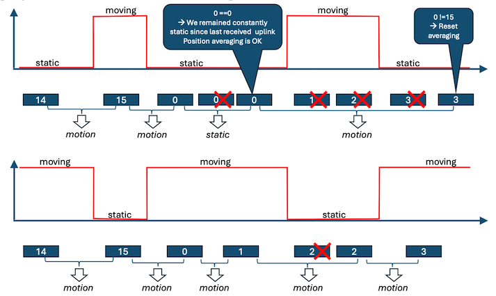

# Application uplinks

This section defines the frame format of uplinks sent to the network.
The network can be either LoRaWAN or LTE.

Most of the messages are sized to fit the maximum LoRa payload size in
the worst case (DR0), which is 51 bytes for EU-868 (repeater
compatible). Note that only responses to a query can exceed this limit
and restrict the MTU to 63, which may trigger a datarate change if
configured in tx_start paramters.

## Cellular network header

**On cellular network only**, the following message header is added:

| **Bytes [0-7]** | **Bytes [8-9]**                  |                  |
|-----------------|----------------------------------|------------------|
| -               | **b15-0**                        | **b7-0**         |
| DevEUI          | MSB Frame up counter            | LSB Frame up counter |

***Byte 0-1 description***

-   **DevEUI.** Device unique identifier. Used on cellular networks to
    discriminate the device which sent the uplink. For convenience, it
    is identical to the LoRaWAN DevEUI.

-   **Frame up counter**. Uplink frame counter. Incremented for each
    uplink. It wraps to 0 after reaching 65535. It is an emulation of
    the LoRaWAN uplink frame counter and serves the same purpose: to be
    able to detect and quantify uplink packet loss when using UDP
    transport.

## Message header

The uplinks are structured with a common header followed by a data
section. The data section varies depending on the type of uplink.

### Basic header

The basic header has 4 bytes and is present in both single-frame and
multi-frame modes.

<table>
  <tbody>
    <tr>
      <td colspan="4"><strong>Byte 0</strong></td>
      <td colspan="2"><strong>Byte 1</strong></td>
      <td colspan="2"><strong>Bytes [2-3]</strong></td>
    </tr>
    <tr>
      <td><strong>b7</strong></td>
      <td><strong>b6</strong></td>
      <td><strong>b5-3</strong></td>
      <td><strong>b2-0</strong></td>
      <td><strong>b7</strong></td>
      <td><strong>b6-0</strong></td>
      <td><strong>b15-8</strong></td>
      <td><strong>b7-0</strong></td>
    </tr>
    <tr>
      <td>M</td>
      <td>S</td>
      <td>Type</td>
      <td>ACK-TK</td>
      <td>S</td>
      <td>Battery %</td>
      <td>MSB timestamp</td>
      <td>LSB timestamp</td>
    </tr>
  </tbody>
</table>

***Byte 0 description***

-   **M**. Multi-frame (0: single frame; 1: multi-frame).
    -   0 - Single frame.
    -   1 -- Multi-frame
-   **S**. SOS.
    -   0 --SOS mode not active
    -   1 -- SOS mode active
-   **Type**. Frame type.:
    -   1 -- **Notification**. Unsolicited message (System start,
        Critical/normal temperature, motion start/stop, SOS start/stop,
        geozoning, battery alert, etc.).
    -   2 -- **Position**. Unsolicited message. Geolocation positions.
    -   3 -- **Query**. Expects a response from the network (aiding
        position request, almanac request, etc.).
    -   4 -- **Response**: Solicited message. Response to network query
        (config get/set, POD, Almanac get/set, etc.).
    -   Other values: Reserved for future use.
-   **ACK-TK**: Ack-token. Value (in \[0..7\]) extracted from the last
    downlink received. It is used to acknowledge the corresponding
    downlink.

***Byte 1 description***

-   **S**. Basic/Special long timestamp header selection bit. Unset for the basic header.
-   **Battery**: Remaining battery capacity expressed as percentage of
    full capacity. Special values:
    -   0: **in charge**
    -   127: **unknown**

***Bytes 2 -- 3*** contain the timestamp indicating when the payload was generated. The value represents the **number of seconds elapsed since the start of the most recent half-day period** (a value of 0 corresponds to either noon or midnight). Over LoRaWAN networks, when the LoRaWAN stack is in multiple transmit mode, the retransmissions keep the same timestamp.

### Special long timestamp header
This header format is used when the `Basic/Special long timestamp header selection bit` is set.
The **special long timestamp header** is 6 bytes long and is used to replay the uplinks stored in the uplink buffer. It is identical to the basic header, except that the timestamp is encoded on 4 bytes.

<table>
  <tbody>
    <tr>
      <td colspan="4"><strong>Byte 0</strong></td>
      <td colspan="2"><strong>Byte 1</strong></td>
      <td colspan="4"><strong>Bytes [2-5]</strong></td>
    </tr>
    <tr>
      <td><strong>b7</strong></td>
      <td><strong>b6</strong></td>
      <td><strong>b5-3</strong></td>
      <td><strong>b2-0</strong></td>
      <td><strong>b7</strong></td>
      <td><strong>b6-0</strong></td>
      <td><strong>b31-24</strong></td>
      <td><strong>...</strong></td>
      <td><strong>...</strong></td>
      <td><strong>b7-0</strong></td>
    </tr>
    <tr>
      <td>M</td>
      <td>S</td>
      <td>Type</td>
      <td>ACK-TK</td>
      <td>S</td>
      <td>Battery %</td>
      <td colspan="4">Long timestamp</td>
    </tr>
  </tbody>
</table>

### Extended header

This header is used when an application message needs to be fragmented
to multiple uplinks ("multi-frame" case).

It consists of a basic header (with M = 1) extended with an extra byte
called m-frame.

<table>
  <tbody>
    <tr>
      <td><strong>Bytes [0-3]</strong></td>
      <td colspan="3"><strong>Byte 4</strong></td>
    </tr>
    <tr>
      <td>Basic header with M=1</td>
      <td>Group</td>
      <td colspan="2">m-frame</td>
    </tr>
    <tr>
      <td rowspan="2"></td>
      <td>b7-5</td>
      <td>b4</td>
      <td>b3-0</td>
    </tr>
    <tr>
      <td>Group ID</td>
      <td>Last</td>
      <td>Fragment number</td>
    </tr>
  </tbody>
</table>

***Byte 4 description***

-   **Group ID**. Group identifier \[0..7\]. It is incremented each time
    a new group of uplinks are sent. It is used to uniquely identify a
    group. It should be used to avoid mixing uplinks belonging to two
    different groups.

-   **Last**. Set to 1 to indicate the last uplink in the group.

-   **Fragment number**. Fragment identifier inside a group \[0..15\].
    It starts at 0 (first uplink) and is incremented for each subsequent
    uplinks belonging to the same group.

## Notifications

This section describes the notification uplinks.

### Overview

The notifications are categorized into classes, with each class
containing different types. The class of notification allows a simple
mechanism (and configuration) for requesting network acknowledgments: A
user may require some classes of notifications to be acknowledged by the
network.

The format of a notification is the following

<table>
  <tbody>
    <tr>
      <td><strong>Bytes [0-3]</strong></td>
      <td colspan="2"><strong>Byte 4</strong></td>
      <td><strong>Bytes [5-variable]</strong></td>
    </tr>
    <tr>
      <td><strong>Basic header (Type =1)</strong></td>
      <td colspan="2">Notification header</td>
      <td>Data</td>
    </tr>
    <tr>
      <td></td>
      <td>b7-4</td>
      <td>b3-0</td>
      <td></td>
    </tr>
    <tr>
      <td></td>
      <td>Class</td>
      <td>Type</td>
      <td></td>
    </tr>
  </tbody>
</table>

***Notification header***
-   Class: Class of notification
-   Type: Type of notification

The classes and types are presented below

**Class 0. System**

| **Type** | **Name**      | **Purpose**            | **Data**                                                   |
|----------|---------------|------------------------|------------------------------------------------------------|
| 0        | Status        | System status          | Versions, temperature, reset cause (in case of crash)      |
| 1        | Low-battery   | Low battery detected   | Consumption + battery voltage                              |
| 2        | BLE           | BLE securely connected | Securely connected/disconnected                            |
| 3        | Tamper        | Tamper detection       | Casing open/closed                                         |
| 4        | Heartbeat     | Heartbeat message      | Temperature, last reset cause and configuration CRC        |
| 5        | Shutdown	     | Shutdown message	      | Shutdown cause: 0 = none; 1 = user action; 2 = low battery |
| 6        | Uplink buffer | Uplink replay          | The uplink message is replayed using the [special long-timestamp header](./application-downlink.md#special-long-timestamp-header) |
| 7        | FUOTA  	     | FUOTA failure reason   | Binary type, download source and failure reason            |

**Class 1. SOS**

| **Type** | **Name**  | **Purpose**        | **Data** |
|----------|-----------|--------------------|-----------|
| 0        | SOS-on    | SOS activated      | None      |
| 1        | SOS-off   | SOS deactivated    | None      |

**Class 2. Temperature**

| **Type** | **Name**       | **Purpose**                      | **Data**     |
|----------|----------------|----------------------------------|--------------|
| 0        | Temp_high      | Critically high temperature reached | Temperature |
| 1        | Temp_low       | Critically low temperature reached  | Temperature |
| 2        | Temp_normal    | Temperature back to normal       | Temperature |

**Class 3. Accelerometer**

| **Type** | **Name**       | **Purpose**             | **Data**                                     |
|----------|----------------|------------------------|----------------------------------------------|
| 0        | Motion_start    | Motion start detected  | None                                         |
| 1        | Motion_end      | Motion end detected    | Acceleration vector + motion percent        |
| 2        | Shock          | Shock detected         | Acceleration vector + GADD index + nb shock  |

**Class 4. Network**

| **Type** | **Name**      | **Purpose**                  | **Data**     |
|----------|---------------|------------------------------|--------------|
| 0        | Main_up       | Main network is up.          | Network data |
| 1        | Backup_up     | Main network down. Backup is up. | Network data |

**Class 5. Geozoning**

| **Type** | **Name**         | **Purpose**                      | **Data**                 |
|----------|------------------|----------------------------------|--------------------------|
| 0        | Entry            | Entry beacon detected           | Beacon ID or MAC address |
| 1        | Exit             | Exit beacon detected            | Beacon ID or MAC address |
| 2        | In_hazard        | Entry in a hazardous area detected | Beacon ID or MAC address |
| 3        | Out_hazard       | Exit from a hazardous area detected | Beacon ID or MAC address |
| 4        | Meeting_point    | Meeting point detected          | Beacon ID or MAC address |

**Class 6. Uplink replay**

The uplink replay notification class uses the [special long-timestamp header](./application-downlink.md#special-long-timestamp-header), followed by the replayed uplink payload.

### Notification class 0
#### Class 0, type 0: System status notification

The status is transmitted with a common section and a page section.
Pages are used to publish information that does not require frequent
updates, using a round robin method. Each time a status notification is
sent, the page number increments until the last page is reached. Once
the last page is sent, the page identifier resets to 0.

*Common part*

<table>
  <tbody>
    <tr>
      <td><strong>1 byte</strong></td>
      <td colspan="2"><strong>1 byte</strong></td>
    </tr>
    <tr>
      <td>Current temperature</td>
      <td colspan="2">Reset cause and page ID</td>
    </tr>
    <tr>
      <td>b7- 0</td>
      <td>b7-3</td>
      <td>b2-0</td>
    </tr>
    <tr>
      <td>[-126 .. +127]</td>
      <td>Reset cause</td>
      <td>Page ID</td>
    </tr>
  </tbody>
</table>

Note

-   **Current temperature**. Current temperature. Signed integer (2's
    complement) expressed in degree Celsius.

-   **Reset cause**:
    -   AOS_ERROR_NONE (0) : No error.
    -   AOS_ERROR_HW_NMI (1): Hardware non-maskable interrupt fault.
    -   AOS_ERROR_HW_FAULT (2): Hardware fault.
    -   AOS_ERROR_HW_MPU (3): Hardware MPU fault.
    -   AOS_ERROR_HW_BUS (4): Hardware bus fault.
    -   AOS_ERROR_HW_USAGE (5): Hardware usage fault.
    -   AOS_ERROR_HW_IRQ (6): Unexpected interruption.
    -   AOS_ERROR_HW_WDOG (7): Watchdog
    -   AOS_ERROR_HW_BOR(8): Brown out reset
    -   AOS_ERROR_SW_ST_HAL_ERROR(9): ST HAL error.
    -   AOS_ERROR_SW_FREERTOS_ASSERT (10): FreeRTOS assertion.
    -   AOS_ERROR_SW_FREERTOS_TASK_OVF (11):FreeRTOS Task stack
        overflow.
    -   AOS_ERROR_SW_BLE_ASSERT(12). BLE core assertion
    -   AOS_ERROR_SW_RTC_FAIL (13): Real Time Clock peripheral fails to
        start.
    -   AOS_ERROR_SW_LORA_FAIL (14): LoRa unrecoverable failure
    -   AOS_ERROR_SW_DEBUG (15): Used to debug
    -   AOS_ERROR_SW_APP_START (16): Application assertions.

-   Page Id
    -   Max page ID = 1 for LoRaWAN only trackers (2 pages).
    -   Max page ID= 3 for Cellular Combo tracker (4 pages).

##### Page 0. General status

<table>
  <tbody>
    <tr>
      <td colspan="3"><strong>3 bytes</strong></td>
      <td colspan="4"><strong>4 bytes</strong></td>
      <td colspan="3"><strong>3 bytes</strong></td>
      <td colspan="2"><strong>2 bytes</strong></td>
    </tr>
    <tr>
      <td colspan="3">AT3 version</td>
      <td colspan="4">Configuration version</td>
      <td colspan="3">LR-HW version</td>
      <td colspan="2">HW batch ID</td>
    </tr>
    <tr>
      <td>b23-16</td>
      <td>b15-8</td>
      <td>b7-0</td>
      <td>b31-24</td>
      <td>b23-16</td>
      <td>b15-8</td>
      <td>b7-0</td>
      <td>b23-16</td>
      <td>b15-8</td>
      <td>b7-0</td>
      <td>b15-8</td>
      <td>b7-0</td>
    </tr>
    <tr>
      <td>M</td>
      <td>m</td>
      <td>i</td>
      <td>M</td>
      <td>m</td>
      <td>i</td>
      <td>u</td>
      <td>HW</td>
      <td>type</td>
      <td>FW</td>
      <td>MSB</td>
      <td>LSB</td>
    </tr>
  </tbody>
</table>

<table>
  <tbody>
    <tr>
      <td colspan="2"><strong>2 bytes</strong></td>
      <td><strong>1 byte</strong></td>
      <td><strong>1 byte</strong></td>
      <td><strong>1 byte</strong></td>
      <td colspan="2"><strong>2 bytes</strong></td>
      <td colspan="2"><strong>2 bytes</strong></td>
    </tr>
    <tr>
      <td colspan="2">HW BOM ID</td>
      <td>
        Max  temperature
      </td>
      <td>Min  temperature</td>
      <td>Motion %</td>
      <td colspan="2">
        Battery  voltage (mV)
      </td>
      <td colspan="2">
        Total  consumption (mAh)
      </td>
    </tr>
    <tr>
      <td>b15-8</td>
      <td>b7-0</td>
      <td>b7-0</td>
      <td>b7-0</td>
      <td>b7-0</td>
      <td>b15-8</td>
      <td>b7-0</td>
      <td>b15-8</td>
      <td>b7-0</td>
    </tr>
    <tr>
      <td>MSB</td>
      <td>LSB</td>
      <td>[-126 .. +127]</td>
      <td>[-126 .. +127]</td>
      <td>[0..100]</td>
      <td>MSB</td>
      <td>LSB</td>
      <td>MSB</td>
      <td>LSB</td>
    </tr>
  </tbody>
</table>

<table>
  <tbody>
    <tr>
      <td colspan="2"><strong>2 bytes</strong></td>
      <td colspan="2"><strong>2 bytes</strong></td>
      <td colspan="2"><strong>2 bytes</strong></td>
      <td colspan="2"><strong>2 bytes</strong></td>
      <td colspan="2"><strong>2 bytes</strong></td>
      <td colspan="2"><strong>2 bytes</strong></td>
    </tr>
    <tr>
      <td colspan="2">
        Cellular  consumption (mAh)
      </td>
      <td colspan="2">
        GNSS  consumption (mAh)
      </td>
      <td colspan="2">
        WIFI  consumption (mAh)
      </td>
      <td colspan="2">
        LR GNSS  consumption (mAh)
      </td>
      <td colspan="2">
        BLE  consumption (mAh)
      </td>
      <td colspan="2">
        MCU  consumption (mAh)
      </td>
    </tr>
    <tr>
      <td>b15-8</td>
      <td>b7-0</td>
      <td>b15-8</td>
      <td>b7-0</td>
      <td>b15-8</td>
      <td>b7-0</td>
      <td>b15-8</td>
      <td>b7-0</td>
      <td>b15-8</td>
      <td>b7-0</td>
      <td>b15-8</td>
      <td>b7-0</td>
    </tr>
    <tr>
      <td>MSB</td>
      <td>LSB</td>
      <td>MSB</td>
      <td>LSB</td>
      <td>MSB</td>
      <td>LSB</td>
      <td>MSB</td>
      <td>LSB</td>
      <td>MSB</td>
      <td>LSB</td>
      <td>MSB</td>
      <td>LSB</td>
    </tr>
  </tbody>
</table>

<table>
    <tr>
      <td colspan="4"><strong>4 bytes</strong></td>
    </tr>
    <tr>
      <td colspan="4"><strong>Config CRC</strong></td>
    </tr>
    <tr>
      <td>b31-24</td>
      <td>b23-16</td>
      <td>b15-8</td>
      <td>b7-0</td>
    </tr>
    <tr>
      <td>MSB</td>
      <td></td>
      <td></td>
      <td>LSB</td>
    </tr>
</table>

**Notes**
-   **M**: AT3 major version (for firmware version and configuration
    version)
-   **m:** AT3 minor version (for firmware version and configuration
    version)
-   **i** : AT3 iteration (for firmware version and configuration
    version)
-   **u**: AT3 configuration user byte
-   **HW:** Hardware version
-   **Type:** Type of hardware
-   **FW:** Firmware version
-   **Max temperature**. Max temperature since the beginning of the
    product life. Signed integer (2's complement) expressed in degree
    Celsius.
-   **Min temperature.** Min temperature since the beginning of the
    product life. Signed integer (2's complement) expressed in degree
    Celsius.
-   **Battery voltage:** Current battery voltage (mV)
-   **Consumption fields**. All consumption fields are in mAh

##### Page 1. Almanac status

<table>
  <tbody>
    <tr>
      <td colspan="2"><strong>2 bytes</strong></td>
      <td><strong>4 bytes</strong></td>
      <td><strong>1 byte</strong></td>
      <td colspan="2"><strong>2 bytes</strong></td>
      <td><strong>5 bytes</strong></td>
      <td><strong>1 byte</strong></td>
    </tr>
    <tr>
      <td colspan="2">
        LR1110 
        GPS 
        date
      </td>
      <td>
        LR1110 
        GPS 
        outdated /
      </td>
      <td>
        LR1110 
        GPS 
        good
      </td>
      <td colspan="2">
        LR1110 
        BEIDOU 
        date
      </td>
      <td>
        LR1110 BEIDOU 
        outdated
      </td>
      <td>
        LR1110 BEIDOU 
        good
      </td>
    </tr>
    <tr>
      <td>b15-8</td>
      <td>b7-0</td>
      <td>b31-0</td>
      <td>b7-0</td>
      <td>b15-8</td>
      <td>b7-0</td>
      <td>b39-0</td>
      <td>b7-0</td>
    </tr>
    <tr>
      <td>MSB</td>
      <td>LSB</td>
      <td>Bit field</td>
      <td>[0..31]</td>
      <td>MSB</td>
      <td>LSB</td>
      <td>Bit field</td>
      <td>[0-37]</td>
    </tr>
  </tbody>
</table>

<table>
  <tbody>
    <tr>
      <td colspan="2"><strong>2 bytes</strong></td>
      <td colspan="2"><strong>2 bytes</strong></td>
      <td colspan="2"><strong>2 bytes</strong></td>
      <td colspan="2"><strong>2 bytes</strong></td>
      <td colspan="2"><strong>2 bytes</strong></td>
      <td colspan="2"><strong>2 bytes</strong></td>
    </tr>
    <tr>
      <td colspan="2">
        GNSS 
        GPS 
        date
      </td>
      <td colspan="2">
        GNSS 
        GPS 
        outdated
      </td>
      <td colspan="2">
        GNSS 
        BEIDOU 
        date
      </td>
      <td colspan="2">
        GNSS 
        BEIDOU 
        outdated
      </td>
      <td colspan="2">
        GNSS BEIDOU 
        good
      </td>
      <td colspan="2">
        GNSS BEIDOU 
        good
      </td>
    </tr>
    <tr>
      <td>b15-8</td>
      <td>b7-0</td>
      <td>b15-8</td>
      <td>b7-0</td>
      <td>b15-8</td>
      <td>b7-0</td>
      <td>b15-8</td>
      <td>b7-0</td>
      <td>b15-8</td>
      <td>b7-0</td>
      <td>b15-8</td>
      <td>b7-0</td>
    </tr>
    <tr>
      <td>MSB</td>
      <td>LSB</td>
      <td>MSB</td>
      <td>LSB</td>
      <td>MSB</td>
      <td>LSB</td>
      <td>MSB</td>
      <td>LSB</td>
      <td>MSB</td>
      <td>LSB</td>
      <td>MSB</td>
      <td>LSB</td>
    </tr>
  </tbody>
</table>

**Notes**

-   **LR1110/GNSS GPS almanac date**. Highest date ( GPS week number)
    over all GPS almanac entries.
-   **LR1110/GNSS GPS outdated**. Bitmap of outdated entries in the GPS
    almanac.
-   **LR1110/GNSS GPS good**. Number of entries matching the highest
    date.
-   **LR1110/GNSS BEIDOU almanac date**. Highest date ( GPS week number)
    over all BEIDOU almanac entries.
-   **LR1110/GNSS BEIDOU outdated**. Bitmap of outdated entries in the
    BEIDOU almanac.
-   **LR1110/GNSS BEIDOU good**. Number of entries having the highest
    date.

Each bit i of the bitmap represents satellite i (1 \<\< i).

##### Page 2. Cellular part I

<table>
  <tbody>
    <tr>
      <td colspan="5"><strong>6 bytes</strong></td>
      <td><strong>21 bytes</strong></td>
      <td><strong>16 bytes</strong></td>
    </tr>
    <tr>
      <td colspan="5">FW version</td>
      <td>ICCID</td>
      <td>IMSI</td>
    </tr>
    <tr>
      <td>b47-40</td>
      <td>b39-32</td>
      <td>b31-24</td>
      <td>b23-16</td>
      <td>b15-0</td>
      <td>Ascii</td>
      <td>Ascii</td>
    </tr>
    <tr>
      <td>branch</td>
      <td>mode</td>
      <td>image</td>
      <td>delivery</td>
      <td>release</td>
      <td></td>
      <td></td>
    </tr>
  </tbody>
</table>

Note that the ICCID and IMSI are available only if a cellular connection
has been established. Otherwise, these values are set to 0.

##### Page 2. Cellular part II

|  **33 bytes** | **16 bytes** |
| ------------- | ------------ |
| EUICCID       | IMEISV       |
| Ascii         | Ascii        |

**Notes**

-   The EUICCID is available only if a cellular connection using the
    eSIM has been established. Otherwise, this value is set to 0 (33
    null bytes).
-   The IMEISV is not yet supported. It is set to a null value (16 NULL
    bytes).

#### Class 0, type 1: Low battery notification

<table>
  <tbody>
    <tr>
      <td colspan="2"><strong>2 bytes</strong></td>
      <td colspan="2"><strong>2 bytes</strong></td>
    </tr>
    <tr>
      <td colspan="2">Consumption</td>
      <td colspan="2">Battery voltage</td>
    </tr>
    <tr>
      <td>b15-8</td>
      <td>b7-0</td>
      <td>b15-8</td>
      <td>b7-0</td>
    </tr>
    <tr>
      <td>MSB</td>
      <td>LSB</td>
      <td>MSB</td>
      <td>LSB</td>
    </tr>
  </tbody>
</table>

**Notes**
-   Consumption is in mAh
-   Battery voltage is in mV

#### Class 0, type 2: BLE notification

<table>
  <tbody>
    <tr>
      <td colspan="2"><strong>1 bytes</strong></td>
    </tr>
    <tr>
      <td colspan="2">State</td>
    </tr>
    <tr>
      <td>b7-1</td>
      <td>b0</td>
    </tr>
    <tr>
      <td>RFU</td>
      <td>state</td>
    </tr>
  </tbody>
</table>

**Notes**
-   State: 0: Disconnected, 1: Connected
-   RFU: Reserved for future use

#### Class 0, type 3: Tamper notification

<table>
  <tbody>
    <tr>
      <td colspan="2"><strong>State</strong></td>
    </tr>
    <tr>
      <td colspan="2">1 byte</td>
    </tr>
    <tr>
      <td>b7-1</td>
      <td>b0</td>
    </tr>
    <tr>
      <td>RFU</td>
      <td>state</td>
    </tr>
  </tbody>
</table>

:::note
- State: 0: Casing closed, 1: Casing open
- RFU: Reserved for future use
:::

#### Class 0, type 4: Heartbeat notification

<table>
  <tbody>
    <tr>
      <td colspan="1"><strong>Temperature</strong></td>
      <td colspan="2"><strong>Info</strong></td>
      <td colspan="4"><strong>Config CRC</strong></td>
    </tr>
    <tr>
      <td>b7-b0</td>
      <td>b7-b3</td>
      <td>b2-b0</td>
      <td>b31-b24</td>
      <td>...</td>
      <td>...</td>
      <td>b7-b0</td>
    </tr>
    <tr>
      <td></td>
      <td>Reset cause</td>
      <td>RFU</td>
      <td>MSB</td>
      <td>...</td>
      <td>...</td>
      <td>LSB</td>
    </tr>
  </tbody>
</table>

:::note
- CRC is set to 0xFFFFFFFF if not available
- RFU: Reserved for future use
:::

#### Class 0, type 5: Shutdown notification
| Shutdown cause |
|----------------|
| 1 byte         |

:::note
Shutdown causes:
-	shutdown_cause_none = 0
-	shutdown_cause_user_action = 1
-	shutdown_cause_low_battery = 2
:::

#### Class 0, type 6: Data buffering notification
The data part of the notification is formatted as follows
<table>
  <tbody>
    <tr>
      <td><strong>Status</strong></td>
      <td colspan="4"><strong>Oldest timestamp</strong></td>
      <td colspan="4"><strong>Latest timestamp</strong></td>
    </tr>
    <tr>
      <td>1 byte</td>
      <td colspan="4">4 bytes</td>
      <td colspan="4">4 bytes</td>
    </tr>
    <tr>
      <td>b7-0</td>
      <td>b31-24</td>
      <td>...</td>
      <td>...</td>
      <td>b7-0</td>
      <td>b31-24</td>
      <td>...</td>
      <td>...</td>
      <td>b7-0</td>
    </tr>
    <tr>
      <td></td>
      <td>MSB</td>
      <td></td>
      <td></td>
      <td>LSB</td>
      <td>MSB</td>
      <td></td>
      <td></td>
      <td>LSB</td>
    </tr>
  </tbody>
</table>

Where:
- Oldest timestamp: Timestamp of the oldest entry
- Latest timestamp: Timestamp of the latest entry
- Status of the uplink replay.
  - 0: Success. Dump complete
  - 1: Timeout. Timeout occurred.
  - 2:  No data found. 

#### Class 0, type 7: FUOTA failure notification

After the binary download and verification process, the tracker reports
any failure by specifying the failure reason. For successful FUOTA
process, a status message is automatically transmitted following a
system reset. The notification format is as follows:

<table>
  <tbody>
    <tr>
      <td colspan="3"><strong>FUOTA result</strong></td>
    </tr>
    <tr>
      <td colspan="3">1 byte</td>
    </tr>
    <tr>
      <td>b7-6</td>
      <td>b5-4</td>
      <td>b3-0</td>
    </tr>
    <tr>
      <td>Binary</td>
      <td>Source</td>
      <td>Reason</td>
    </tr>
  </tbody>
</table>

Where:
- Binary:
  - 0 – Application.
  - 1 – BLE stack.
  - 2 – MT3333.
  - 3 – LR11XX.
- Source:
  - 0 – Xmodem. 
  - 1 – BLE.
  - 2 – Cellular.
  - 3 – LoRa.
- Status:
  - 0 – none.
  - 1 – Network issue (network was lost during the binary download or couldn’t connect to FUOTA server).
  - 2 – Timeout (the binary download timed out).
  - 3 – Modem failure (the cellular modem failed to execute file download commands).
  - 4 – File not found (the binary file to download was not found on the remote server).
  - 5 – Platform error (binary code verification done, platform incorrect).
  - 6 – Parsing error (binary code verification done, trailer parsing error).
  - 7 – Flash error (binary code verification done, read external flash error).
  - 8 – Length error (binary code verification done, length error).
  - 9 – Signature error (binary code verification done and signature failure).

### Notification class 1: SOS

No data. The SOS status is in the basic header.

### Notification class 2: temperature

The 3 types of notification are : Critically high temperature (type 0) /
Critically low temperature (type 1) / Return to normal temperature range (type 2)

Each of these notifications includes the temperature which triggered the
notification.

| **1 byte**     |
| -------------- |
| Temperature    |
| b7-0           |
| [-126 .. +127] |

The temperature is signed (2's complement coding) and is in degrees
Celsius.

### Notification class 3: accelerometer

The data part of this notification class depends on the type.

#### Class 3, type 0: Motion start

No data

#### Class 3, type 1: Motion end

<table>
  <tbody>
    <tr>
      <td colspan="2"><strong>2 bytes</strong></td>
      <td colspan="2"><strong>2 bytes</strong></td>
      <td colspan="2"><strong>2 bytes</strong></td>
      <td><strong>1 byte</strong></td>
    </tr>
    <tr>
      <td colspan="2">Acceleration X</td>
      <td colspan="2">Acceleration Y</td>
      <td colspan="2">Acceleration Z</td>
      <td>Motion %</td>
    </tr>
    <tr>
      <td>b15-8</td>
      <td>b7-0</td>
      <td>b15-8</td>
      <td>b7-0</td>
      <td>b15-8</td>
      <td>b7-0</td>
      <td>b7-0</td>
    </tr>
    <tr>
      <td>MSB</td>
      <td>LSB</td>
      <td>MSB</td>
      <td>LSB</td>
      <td>MSB</td>
      <td>LSB</td>
      <td>[0..100]</td>
    </tr>
  </tbody>
</table>

The 3 axis measurement of gravity after the device has stopped allows to
infer the angular position of the device. They are expressed as mg
signed values (2's complement coding)

#### Class 3, type 3: Shock

<table>
  <tbody>
    <tr>
      <td colspan="2"><strong>2 bytes</strong></td>
      <td colspan="2"><strong>2 bytes</strong></td>
      <td colspan="2"><strong>2 bytes</strong></td>
      <td><strong>1 byte</strong></td>
      <td><strong>1 byte</strong></td>
    </tr>
    <tr>
      <td colspan="2">Acceleration X</td>
      <td colspan="2">Acceleration Y</td>
      <td colspan="2">Acceleration Z</td>
      <td>GADD index</td>
      <td>Nb shocks</td>
    </tr>
    <tr>
      <td>b15-8</td>
      <td>b7-0</td>
      <td>b15-8</td>
      <td>b7-0</td>
      <td>b15-8</td>
      <td>b7-0</td>
      <td>b7-0</td>
      <td>b7-0</td>
    </tr>
    <tr>
      <td>MSB</td>
      <td>LSB</td>
      <td>MSB</td>
      <td>LSB</td>
      <td>MSB</td>
      <td>LSB</td>
      <td>[0..100]</td>
      <td>[1-255]</td>
    </tr>
  </tbody>
</table>

The 3 axis measurement of maximum shock accelerations are expressed in
mg signed values (2's complement coding), allowing to infer the
direction of the shock.

Body damage is more accurately represented by the Gadd index, which
integrates acceleration intensity over total shock duration.

### Notification class 4: network 

The data part of this class of notifications does not depend on the type
and is the following:

| **1 byte**     | **1 byte**   | **1 byte**     |
| -------------- | ------------ | -------------- |
| Active network | Main network | backup network |
| b7-0           | b7-0         | b7-0           |
| [0..2]         | [0..2]       | [0..2]         |

Each byte encodes a network technology:
-   0: No network
-   1: LoRaWAN network
-   2: Cellular network in low power mode
-   3: Cellular network in high power mode

### Notification class 5: geozoning

Not yet supported

## Positions

The position messages can be sent in either single-frame mode or
multi-frames mode.

### Position header

The basic position header is defined as follows:

Single frame mode

| **Bytes [0-3]**             | **Bytes 4-7**      | **Bytes [8-variable]** |
| --------------------------- | --------------- | ---------------------- |
| Basic header (**Type = 2**) | Position header | Data                   |

Multi-frame mode

| **Bytes [0-4]**                | **Byte 5-8**      | **Bytes [9-variable]** |
| ------------------------------ | --------------- | ---------------------- |
| Extended header (**Type = 2**) | Position header | Data                   |

The position header is defined as follows:

<table>
  <tbody>
    <tr>
      <td colspan="6"><strong>Position header 4 bytes</strong></td>
    </tr>
    <tr>
      <td colspan="3">Information</td>
      <td colspan="2">Extended info</td>
      <td>Triggers (2 bytes)</td>
    </tr>
    <tr>
      <td>b7</td>
      <td>b6-5</td>
      <td>b4-0</td>
      <td>b7-4</td>
      <td>b3-0</td>
      <td>b15-b0</td>
    </tr>
    <tr>
      <td>M</td>
      <td>Status</td>
      <td>Position type</td>
      <td>RFU</td>
      <td>M-cnt</td>
      <td>Trigger bit-map</td>
    </tr>
  </tbody>
</table>

***Position header***

**Information**

-   b7: **M**. Motion bit. Set if a motion event has been detected since
    the transmission of the previous position payload.
-   b6-5: **Status**. Status of the position
    -   0 -- Success. Data contains the position.
    -   1 -- Timeout. Max time allowed to acquire the position. Optional
        data.
    -   2 -- Failure. Position acquisition failed for other reasons.
        Data contains failure reason or no data.
    -   3 -- Not-solvable: The acquisition has been completed but is not
        solvable (WIFI, BLE or AGNSS). Optional data.
-   b4-0: **Position type**
    -   0 -- LR1110 GNSS formatted Nav1
    -   1 -- LR1110 GNSS Semtech Nav1
    -   2 -- LR1110 GNSS Semtech Nav 2
    -   3 -- WIFI
    -   4 - BLE scan1 (report mode: MAC-address)
    -   5 -- BLE scan1 (report mode: Short IDs)
    -   6 -- BLE scan1 (report mode Long IDs)
    -   7 - BLE scan2 (report mode: MAC-address)
    -   8 -- BLE scan2 (report mode: Short IDs)
    -   9 -- BLE scan2 (report mode Long IDs)
    -   10 - MT3333 GNSS fix
    -   11 -- MT3333 LP-GNSS

**Extended info**
-   b7-4: RFU (Reserved For Future Use)
-   b3-0: M-cnt. 4-bit motion counter. Increments if a motion event has
    been detected since the transmission of the previous position
    payload. The counter rolls over once the max value is reached.

**Note**:

This 4-bit motion counter allows the geolocation back-end application 
to detect whether there has been motion between 2 successive          
geolocation uplinks by comparing the value of the motion counter with 
its previously received value. This works even if we have lost up to  
14 consecutive in-motion uplinks, and any number of static uplinks.   
This enables the static position averaging filters to reset properly  
if the location of the tracker has changed.                           
                                                                      
                                       
                                                                      
In order to work properly, a reliable deduplication algorithm should  
be implemented in order to avoid comparing the counter value with the 
same value from a packet transmitted multiple times (custom           
retransmit policy). In AT3, this can be based on the value of the     
basic header 2-byte timestamp field.                                  

**Trigger**

Bit-field providing the geolocation triggers that were active for this
position. Refer to the [geolocation manager](./geoloc-manager) section for the bit meaning.

### LR1110 GNSS Formatted Nav1

This position message can carry up to 10 satellite information fields. The multi-frame format can be used if there are more than 10 satellites or the user trigerred multiple scans.

<table>
  <tbody>
    <tr>
      <td><strong>Time</strong></td>
      <td colspan="4"><strong>Sat 1 info</strong></td>
      <td><strong>Sat 2 info</strong></td>
    </tr>
    <tr>
      <td>4 bytes</td>
      <td colspan="4">4 bytes</td>
      <td>4 bytes</td>
    </tr>
    <tr>
      <td>-</td>
      <td>b31-30</td>
      <td>b29-24</td>
      <td>b23-22</td>
      <td>b21-0</td>
      <td>Same as sat 1</td>
    </tr>
    <tr>
      <td>-</td>
      <td>C</td>
      <td>ID</td>
      <td>CN</td>
      <td>PRN</td>
      <td>Same as sat 1</td>
    </tr>
  </tbody>
</table>

**Time** : LR1110 SW Time (TOW) in microseconds, MSB first (big endian).
| b31-20              | b19- 0      |
|---------------------|-------------|
| second in the hour | microseconds |

**Sat x info**
Uses the same encoding as for the MT3333 GNSS

-   b31-30: **C**. Constellation:
    -   0 -- GPS
    -   1 -- BEIDOU
    -   2, 3 - Spare
-   b29-24: **ID**. Satellite identifier starting at 0 regardless of the constellation type.
-   b23-22: **CN**. Carrier to noise information
    -   3 -- C/N greater than 34 dB
    -   2 -- C/N in range \[28-33\] dB
    -   1 - C/N in range \[22-27\] dB
    -   0 - C/N less than 21 dB
-   b21-0: **PRN**. Pseudo range value. Coded for a full scale of 1ms shifted by 2 to the right.

### LR1110 GNSS Semtech Nav2

The data part is the actual data payload received from the LR1110. It is
encoded and only Semtech (or licensed users like Abeeway) can decode it.
It should be forwarded as-is to the Semtech cloud.

The multi-frame format can be used. In this case each frame carries a
single scan.

### WIFI

This uplink message can carry up to 6 BSSIDs per frame. To carry more
BSSIDs, the multi-frame will be used if the payload size requires it.

Payload format

<table>
  <tbody>
    <tr>
      <td colspan="7"><strong>7 bytes</strong></td>
      <td><strong>7 bytes</strong></td>
    </tr>
    <tr>
      <td colspan="7">BSSID 1 info</td>
      <td>BSSID 2 info</td>
    </tr>
    <tr>
      <td colspan="6">MAC address (6 bytes)</td>
      <td>1 byte</td>
      <td>Same as BSSID 1</td>
    </tr>
    <tr>
      <td>MSB</td>
      <td></td>
      <td></td>
      <td></td>
      <td></td>
      <td>LSB</td>
      <td>RSSI</td>
      <td>Same</td>
    </tr>
  </tbody>
</table>

**Note**

The RSSI is a negative value (2's complement) carrying the Received
Signal Strength Information (in dB).

To fit the LoRa maximum payload size in the worst condition, the number
of BSSI per frame is limited to 6. Above this value, the multi-frame is
used.

### BLE scan. MAC address

This uplink message can carry up to 6 beacon information per frame. To
carry more beacons, the multi-frame can be used.

Payload format

<table>
  <tbody>
    <tr>
      <td colspan="7"><strong>7 bytes</strong></td>
      <td><strong>7 bytes</strong></td>
    </tr>
    <tr>
      <td colspan="7">Beacon 1 info</td>
      <td>Beacon 2 info</td>
    </tr>
    <tr>
      <td colspan="6">Identifier (6 bytes)</td>
      <td>1 byte</td>
      <td>Same as Beacon 1</td>
    </tr>
    <tr>
      <td>MSB</td>
      <td></td>
      <td></td>
      <td></td>
      <td></td>
      <td>LSB</td>
      <td>RSSI</td>
      <td>Same</td>
    </tr>
  </tbody>
</table>

**Notes**

-   The identifier is the MAC address if the report type is MAC address,
    otherwise it is 6 bytes extracted as the beacon identifier.
-   The RSSI is a negative value (2's complement) carrying the Received
    Signal Strength Information (in dB).
-   To fit the LoRaWAN maximum payload size in the worst condition, the
    number of Beacon info per frame is limited to 6. Above this value,
    the multi-frame is used.

### BLE scan. Short ID

This uplink message can carry up to 14 beacon information fields per
frame. To carry more beacons, the multi-frame can be used.

Payload format

<table>
  <tbody>
    <tr>
      <td colspan="3"><strong>3 bytes</strong></td>
      <td><strong>3 bytes</strong></td>
      <td><strong>3 bytes</strong></td>
    </tr>
    <tr>
      <td colspan="3">Beacon 1 info</td>
      <td>Beacon 2 info</td>
      <td>Beacon 3 info</td>
    </tr>
    <tr>
      <td colspan="2">Beacon ID (2 bytes)</td>
      <td>1 byte</td>
      <td>Same as beacon 1</td>
      <td>Same as beacon 1</td>
    </tr>
    <tr>
      <td>MSB</td>
      <td>LSB</td>
      <td>RSSI</td>
      <td>Same as beacon 1</td>
      <td>Same as beacon 1</td>
    </tr>
  </tbody>
</table>

**Note**

The RSSI is a negative value (2's complement) carrying the Received
Signal Strength Information (in dB).

To fit the LoRaWAN maximum payload size in the worst conditions, the
number of Beacon info per frame is limited to 14. Above this value, the
multi-frame is used.

### BLE scan. Long ID 

This uplink message can carry up to 2 beacon information fields per
frame. To carry more beacons, the multi-frame format can be used.

Payload format

<table>
  <tbody>
    <tr>
      <td colspan="7"><strong>17 bytes</strong></td>
      <td><strong>17 bytes</strong></td>
    </tr>
    <tr>
      <td colspan="7">Beacon 1 info</td>
      <td>Beacon 2 info</td>
    </tr>
    <tr>
      <td colspan="6">Beacon ID (16 bytes)</td>
      <td>1 byte</td>
      <td>Same as Beacon 1</td>
    </tr>
    <tr>
      <td>MSB</td>
      <td></td>
      <td></td>
      <td></td>
      <td></td>
      <td>LSB</td>
      <td>RSSI</td>
      <td>Same</td>
    </tr>
  </tbody>
</table>

**Note**

The RSSI is a negative value (2's complement) carrying the Received
Signal Strength Information (in dB).

To fit the LoRaWAN maximum payload size in the worst condition, the
number of Beacon info per frame is limited to 2. Above this value, the
multi-frame is used.

### MT3333 GNSS fix

This uplink message carries a GNSS fix or the GNSS satellites tracking
if the fix failed.

***Payload format in case of success***

<table>
  <tbody>
    <tr>
      <td colspan="4"><strong>4 bytes</strong></td>
      <td colspan="4"><strong>4 bytes</strong></td>
      <td colspan="2"><strong>2 bytes</strong></td>
      <td colspan="2"><strong>2 bytes</strong></td>
      <td colspan="2"><strong>2 bytes</strong></td>
      <td><strong>1 byte</strong></td>
      <td><strong>1 byte</strong></td>
    </tr>
    <tr>
      <td colspan="4">Latitude</td>
      <td colspan="4">Longitude</td>
      <td colspan="2">Altitude</td>
      <td colspan="2">COG</td>
      <td colspan="2">SOG</td>
      <td>EHPE</td>
      <td>Quality</td>
    </tr>
    <tr>
      <td>MSB</td>
      <td></td>
      <td></td>
      <td>LSB</td>
      <td>MSB</td>
      <td></td>
      <td></td>
      <td>LSB</td>
      <td>MSB</td>
      <td>LSB</td>
      <td>MSB</td>
      <td>LSB</td>
      <td>MSB</td>
      <td>LSB</td>
      <td>-</td>
      <td>-</td>
    </tr>
  </tbody>
</table>

**Notes**

-   The latitude the longitude are signed value (2's complement) and
    expressed with a unit of 10^-7^ degree.
-   The altitude is signed and expressed in meters.
-   COG: Course Over Ground expressed in 1/100 of degrees
-   SOG: Speed Over Ground expressed cm/second
-   EHPE is encoded as follows:

| **Coded value** | **EHPE in meters** |
| --------------- | ------------------ |
| 0 – 250         | 0 – 250 meters     |
| 251             | 250 < EHPE < 500   |
| 252             | 500 < EHPE < 1000  |
| 253             | 1000 < EHPE < 2000 |
| 254             | 2000 < EHPE < 4000 |
| 255             | EHPE > 4000        |

-   Quality: Fix quality coded as follow:
    -   Bits b7-5: Quality:
        -   0 -- invalid: The GNSS gave a fix but consider it as invalid
        -   1 -- valid: The GNSS gave a fix but has no idea if it is a
            2D or 3D
        -   2 -- fix 2D: Fix valid for 2 dimension (latitude and
            longitude valid).
        -   3 -- fix 3D Fix valid for 3 dimension (latitude, longitude
            and altitude valid).
    -   Bits b4-0: Number of satellites used for the fix. Max 12

***Payload format in case of failure or timeout***

<table>
  <tbody>
    <tr>
      <td><strong>1 byte</strong></td>
      <td colspan="2"><strong>2 bytes</strong></td>
      <td colspan="2"><strong>2 bytes</strong></td>
      <td><strong>...</strong></td>
    </tr>
    <tr>
      <td>Status</td>
      <td colspan="2">Sat 0</td>
      <td colspan="2">Sat 1</td>
      <td>...</td>
    </tr>
    <tr>
      <td>-</td>
      <td>svId</td>
      <td>Info</td>
      <td>svId</td>
      <td>Info</td>
      <td>...</td>
    </tr>
  </tbody>
</table>

**Notes**

-   The Status field is coded as follow:

    -   b7 -- b5: Cause

        -   0: T0 timeout

        -   1: T1 timeout

        -   2: acquisition timeout

    -   b4 -- b0: Number of satellites seen.

-   The info field is coded on 1 byte and is formatted as follow:

    -   b7-b6: Constellation

        -   0: GPS

        -   1: GLONASS

        -   2: BEIDOU

        -   3: GALILEO

    -   b5-0: C/N0 in dBm

###  MT3333 LP-GNSS

This position message can carry up to 9 satellites information fields.
The multi-frame format can be used. In this case each frame carries a
single scan.

<table>
  <tbody>
    <tr>
      <td><strong>4 bytes</strong></td>
      <td colspan="4"><strong>4 bytes</strong></td>
      <td><strong>4 bytes</strong></td>
    </tr>
    <tr>
      <td>Time</td>
      <td colspan="4">Sat 1 info</td>
      <td>Sat 2 info</td>
    </tr>
    <tr>
      <td>-</td>
      <td>b31-30</td>
      <td>b29-24</td>
      <td>b23-22</td>
      <td>b21-0</td>
      <td>Same as sat 1</td>
    </tr>
    <tr>
      <td>-</td>
      <td>C</td>
      <td>ID</td>
      <td>CN</td>
      <td>PRN</td>
      <td>Same</td>
    </tr>
  </tbody>
</table>

**Time** : MT333 SW Time (TOW) in microseconds. It is sent MSB first
(big endian).

| **Bits**        | 31 - 20                | 19 - 0          |
| --------------- | ---------------------- | --------------- |
| **Description** | Nb seconds in the hour | Nb microseconds |

**Sat x info. Coded the same way than LR1110 NAV1 (with bit 21-19
used).**

-   b31-30: **C**. Constellation:
    -   0 -- GPS
    -   1 -- BEIDOU
    -   2, 3 - Spare
-   b29-24: **ID**. Satellite identifier starting at 0 regardless the
    constellation type.
-   b23-22: **CN**. Carrier to noise information
    -   3 -- C/N greater than 34 dB
    -   2 -- C/N in range \[28.. 33\] dB
    -   1 - C/N in range \[22..27\] dB
    -   0 - C/N less than 21 dB

-   b21-0: PRN. Pseudo range value. Coded for a full scale of 1ms
    shifted by 2 to the right.

## Device queries

These uplink messages expect a response. They are always sent in single-frame mode.

The device queries are formatted as follows.

| **Bytes [0-3]**             | **Byte 4**   | **Bytes [5-variable]** |
| --------------------------- | ------------ | ---------------------- |
| Basic header (**Type = 3**) | Query header | Data                   |

***Query header***

-   b7-b5: Spare bits
-   b4-0: **Query type**:
    -   0 -- Aiding-position. The aiding position is needed by the
        tracker. **No data**.
    -   1 -- Update system time. The system time update is needed. **No
        data**
    -   2 -- Update GPS almanac. GPS almanac entries need to be
        refreshed. Data contains the list of satellites for which the
        update is needed.
    -   3 -- Update BEIDOU almanac. BEIDOU almanac entries need to be
        refreshed. Data contains the list of satellites for which the
        update is needed.

## Echo-request

This query is used to probe the cellular network. It is only used for the cellular network (For LoRaWAN, AT3 uses the LoRaWAN link-check requests).

| Data part |
| 1 byte |
| Sequence number|

**Note**
The tracker increments the sequence number for each transmission.
The [echo reply](./application-downlink.md#echo-reply) is expected to echo the same sequence number.

### Update GPS almanac

The tracker will send this network assistance query each time the percentage of stale almanac entries exceeds the threshold configured in the[`core_almanac_outdated_ratio` parameter](./configuration.md#parameter-identifiers-and-groups)

Several SVs almanacs may be requested at a time. The data part is a list of SV identifiers defined as follows:

| **1 Byte**       |  **1 Byte**     | **...** |
| ---------------- | --------------- | ------- |
| SV ID1 1 [0..31] | SV ID 2 [0..31] | ...     |

**Notes**
- **SV ID** means Space Vehicle identifier. The first satellite identifier is 0.
- Due to the limited payload size on the LoRa network (EU868, DR0-2, Max: 59 bytes), only 3 entries can be updated in a downlink. So the number of almanac entries requested in a single request is limited to 3.

### Update BEIDOU almanac

The tracker will send this network assistance query each time the percentage of stale almanac entries exceeds the threshold configured in the[`core_almanac_outdated_ratio` parameter](./configuration.md#parameter-identifiers-and-groups)

Several SVs almanacs may be requested at a time. The data part is a list of SV identifiers defined as follow:

| **1 Byte**      |  **1 Byte**      | **...** |
| --------------- | ---------------- | ------- |
| SV ID1  [0..34] | SV ID 2  [0..34] | ...     |

**Note**
- **SV ID** means Space Vehicle identifier. The first satellite identifier is 0.
- Due to the limited payload size on the LoRa network (EU868, DR0-2, Max: 59 bytes), only 3 entries can be updated in a downlink. So the number of almanac entries requested in a single request is limited to 3.

## Responses

These messages carry the responses to [network requests](./application-downlink.md#requests). The multi-frame format can be used to segment long responses.

**Single frame mode**

| **Bytes [0-3]**             | **Byte 4**      | **Bytes [5-variable]** |
| --------------------------- | --------------- | ---------------------- |
| Basic header (**Type = 4**) | Response header | Data                   |

**Multi-frame mode**

| **Bytes [0-4]**                | **Byte 5**      | **Bytes [6-variable]** |
| ------------------------------ | --------------- | ---------------------- |
| Extended header (**Type = 4**) | Response header | Data                   |

***Response header***

-   b7-b5: Spare bits
-   b4-0: **Response type**
    -   0 -- Response to a [`Generic configuration set request`](./application-downlink.md#generic-configuration-set-request).
    -   1 -- Response to a [`Parameter class configuration set request`](./application-downlink.md#parameter-class-configuration-set-request).
    -   2 -- Response to a [`Generic configuration get request`](./application-downlink.md#generic-configuration-get-request).
    -   3 -- Response to a [`Parameter class configuration get request`](./application-downlink.md#parameter-class-configuration-get-request).
    -   4 -- Response to a [`BLE connectivity status request`](./application-downlink.md#ble-connectivity-status-request).
    -   5 -- Response to a [`Configuration CRC request`](./application-downlink.md#configuration-crc-request).
    -   6 -- Response to a [`Get sensor value request`](./application-downlink.md#get-sensor-value-request).
    -   7 -- Response to a [`Get information request`](./application-downlink.md#get-information-request).
    -   8 -- Response to a [`FUOTA request`](./application-downlink.md#fuota-request).

### `Generic configuration set response`.

This is the response to the [`Generic configuration set request`](./application-downlink.md#generic-configuration-set-request).

The data part can acknowledge the modification of up to 16 parameters.

<table>
  <tbody>
    <tr>
      <td colspan="3"><strong>4 Bytes</strong></td>
      <td colspan="3"><strong>3 Bytes</strong></td>
      <td colspan="3"><strong>3 Bytes</strong></td>
      <td><strong>...</strong></td>
    </tr>
    <tr>
      <td>CRC</td>
      <td>C-ID</td>
      <td>L-ID</td>
      <td>Status</td>
      <td>C-ID</td>
      <td>L-ID</td>
      <td>Status</td>
      <td>...</td>
    </tr>
  </tbody>
</table>

-   **CRC**. The 4 lowest bytes of the global configuration CRC.
-   **C-ID**. Parameter class identifier
-   **L-ID:** Local parameter identifier
-   **Status**. Local status for the parameter.
    -   0 -- Success
    -   1 -- Not found
    -   2 -- Below lower bound. For string and byte-array, length below the
    minimum
    -   3 -- Above higher bound. For string and byte-array, length above the
    maximum
    -   4 -- Bad value. Value in acceptable range but not is not supported.
    -   5 - Type mismatch
    -   6 -- Operation error (operation failure)
    -   7 -- Read-only variable.

### `Parameter class configuration set response`

This is the response to the [`Parameter class configuration set request`](./application-downlink.md#parameter-class-configuration-set-request).

The data part acknowledge the modification of up to 24 parameters.

<table>
  <tbody>
    <tr>
      <td><strong>1 byte</strong></td>
      <td colspan="2"><strong>2 Bytes</strong></td>
      <td colspan="2"><strong>2 Bytes</strong></td>
      <td><strong>...</strong></td>
    </tr>
    <tr>
      <td>C-ID</td>
      <td>L-ID</td>
      <td>Status</td>
      <td>L-ID</td>
      <td>Status</td>
      <td>...</td>
    </tr>
  </tbody>
</table>

- **C-ID**. Parameter class identifier
- **L-ID**: Local parameter identifier
- **Status**. Local status for the parameter.
  -   0 -- Success
  -   1 -- Not found
  -   2 -- Below lower bound. For string and byte-array, length below the minimum
  -   3 -- Above higher bound. For string and byte-array, length above the maximum
  -   4 -- Bad value. Value in acceptable range but not is not supported.
  -   5 -- Type mismatch
  -   6 -- Operation error (operation failure)
  -   7 -- Read-only variable. 

### `Generic configuration get response`

This is the response to the [`Generic configuration get`](./application-downlink.md#generic-configuration-get-request).
The data part consists of a list of parameters belonging to any parameter classes.
The multi-frame format can be used. Note that for some parameters, the size is variable. So it is advised to avoid requesting too many parameters at a time.

Parameters description:

<table>
  <tbody>
    <tr>
      <td colspan="4"><strong>Parameter entry</strong></td>
      <td><strong>&hellip;</strong></td>
    </tr>
    <tr>
      <td colspan="3">3 Bytes</td>
      <td>Variable</td>
      <td>...</td>
    </tr>
    <tr>
      <td>C-ID</td>
      <td>L-ID</td>
      <td>S/T</td>
      <td>Data</td>
      <td>...</td>
    </tr>
  </tbody>
</table>

- **C-ID** Parameter class identifier
- **L-ID:** Local parameter identifier
- **S/T:** Parameter size and type
  -   Bit 7-3: Variable size
  -   Bit 2-0: type
      -   0 -- Deprecated.
      -   1 -- Integer 32 bits
      -   2 -- Floating point (4 bytes)
      -   3 -- ASCII string
      -   4 -- Byte array
      -   5 - Error
- **Data**: Variable data part
  -   Deprecated. No data.
  -   Integer 32 bits. 4 bytes in big endian (MSB first)
  -   Floating point. Single precision, 4 bytes n big endian (MSB first)
  -   ASCII string. Max 31 characters. It does not include the NULL char.
  -   Byte array. Max 32 bytes. For 32 bytes, the parameter size will be 0.  

### `Parameter class configuration get response`

This is the response to the [`Parameter class configuration get request`](./application-downlink.md#parameter-class-configuration-get-request).
The data part consists of a list of parameters belonging to any classes.
The multi-frame format can be used. Note that for some parameters, the size is variable. The total response size is limited by the network MTU, therefore avoid requesting too many parameters at a time.

The data part starts with the parameter class identifier, followed by a list of parameter entries.

<table>
  <tbody>
    <tr>
      <td> Class </td>
      <td colspan="3"><strong>Parameter entry 1</strong></td>
      <td colspan="3"><strong>Parameter entry 2</strong></td>
      <td><strong>...</strong></td>
    </tr>
    <tr>
      <td>1 byte</td>
      <td>1 byte</td>
      <td>1 byte</td>
      <td>Variable</td>
      <td>1 byte</td>
      <td>1 byte</td>
      <td>Variable</td>
      <td>...</td>
    </tr>
    <tr>
      <td>C-ID</td>
      <td>L-ID</td>
      <td>S/T</td>
      <td>Data</td>
      <td>L-ID</td>
      <td>S/T</td>
      <td>Data</td>
      <td>...</td>
    </tr>
  </tbody>
</table>

- **C-ID**. Parameter class identifier
- **L-ID:** Local parameter identifier
- **S/T** Parameter size and type.
  -   Bit 7-3: Parameter size
  -   Bit 2-0: type
    -   0 -- Deprecated
    -   1 -- Integer 32 bits
    -   2 -- Floating point (4 bytes)
    -   3 -- ASCII string
    -   4 -- Byte array
    -   5 - Error
- **Data**: Variable data part
  -   Deprecated. No data
  -   Integer 32 bits. 4 bytes in big endian (MSB first)
  -   Floating point. Single precision, 4 bytes n big endian (MSB first)
  -   ASCII string. Max 31 characters. It does not include the NULL char.
  -   Byte array. Max 32 bytes. For 32 bytes, the parameter size will be 0.

### `BLE connectivity status response`

This is the response to the [`BLE connectivity status request`](./application-downlink.md#ble-connectivity-status-request)/
The data part consists of the BLE status.

| Status |
| 1 Byte |

The *status* can take one of the following values:

**Notes**
-   **0** -- Idle: No connectivity activity.
-   **1** -- Advertising.
-   **2** -- Connected: the devices is connected but not bonded.
-   **3** -- Bonded: the devices is connected and bonded.

### `Configuration CRC response`

This is the response to the [`Configuration CRC request`](./application-downlink.md#configuration-crc-request).
The data part consists of a list of configuration CRC groups matching the request.

**If No groups defined in the request (bitmap null)**
The data part consists of the requested bitmap and global configuration CRC (all groups except the internal)

| 2 bytes	| 4 Bytes |
| Bitmap	| CRC |

**If groups have been defined in the request**
The data part consists of the requested bitmap, followed by group configuration CRCs truncated to the 3 lower bytes.

| 2 bytes | 3 bytes | 3 bytes | ... |
| Bitmap | CRC1 | CRC2 | ... |

The **bitmap** has the same format as in the request, i.e. sum of 2<up>group_identifier</up>. For example if groups 1, 3 and 7 are requested, the bitmap will be  2<up>1</up> + 2<up>3</up> + 2<up>7</up> = 138 = 0x8A

### `Get sensor value response`

This is the response to the [`Get sensor value request`](./application-downlink.md#get-sensor-value-request).
The data part is the list of the sensor values requested.

| Sensor ID 1	| Value for ID1 | Sensor ID 2	| Value for ID2 | ... |
| 1 byte	| variable | 1 byte	| variable | ... |

- **Sensor ID** is the sensor identifier:
    - 0 : Reserved, do not use.
    - 1 : Accelerometer

- **Values** serialization depends on the sensor:
    - Accelerometer: accelerations along each axis, as big endian signed integrers.

    | X axis (mg) | Y axis (mg) | Z axis (mg) |
    | 2 bytes | 2 bytes | 2 bytes |

### `Get information response`

This is the response to the [`Get information request`](./application-downlink.md#get-information-request).

**Generic response**
| Type   | Data     |
|--------|----------|
| 1 byte | Variable |

Where type matches the request's value.

**Debug diagnostics after a crash**
| Code   | Stype     | Information |
|--------|-----------|-------------|
| 1 byte | 1 byte    | Variable    |

Where
- Code: crash code, refer to status uplink page 0.
  A null value means that the device the last reset was not caused by an error/crash.
- Stype: 
  - 0: Hardware registers
  - 1: Error string

Abeeway support will request this diagnostics information in case you face unstabilty.

### `FUOTA response`

This is the response to the [`FUOTA request`](./application-downlink.md#fuota-request).

**Generic response**
| Status |
|--------|
| 1 byte |

Where:
- Status
  - 0 – Start Asap (the FUOTA process is supported and will start ASAP).
  - 1 – Scheduled (the FUOTA process is supported and scheduled).
  - 2 – Denied operation not supported (No LTE module or external flash not mounted).
  - 3 – Denied cellular network not configured (No IP/URL or Port).
  - 4 – Denied FUOTA server not configured (No URL/IP configured).
  - 5 – Denied (temporarily not allowed, e.g., SOS, etc.).
  - 6 – Denied low battery.
  - 7 – Denied low temperature.
  - 8 – Denied high temperature.
  - 9 – Denied incorrect user request.

**Debug diagnostics after a crash**
| Code   | Stype     | Information |
|--------|-----------|-------------|
| 1 byte | 1 byte    | Variable    |

Where
- Code: crash code, refer to status uplink page 0.
  A null value means that the device the last reset was not caused by an error/crash.
- Stype: 
  - 0: Hardware registers
  - 1: Error string

Abeeway support will request this diagnostics information in case you face unstabilty.

### `System status response`

This is the response to the [`System status command`](./application-downlink.md#commands).

The response data format is identical to the status notification format, see section [System status
notification](#system-status-notification).