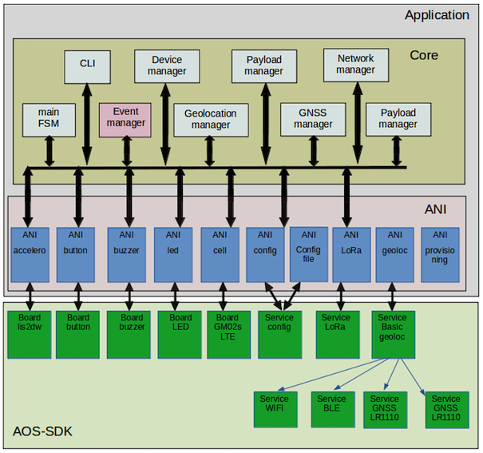

# Application design

The application design can be pictured as follow.

 

The application is structured in two layers:
-	**ANI (Application Node Interface)**. It performs the link between the application and the underlying service. It usually controls a single service. It registers against the associated service callback and transforms the service events to application events. Note that an ANI can also register against the event manager to catch specific events and perform dedicated action regarding the service it manages.
-	**Core**. This is the main part of the application. It includes:
    -	A main FSM (Finite State Machine), which manages the system state (off, running hold, and so on).
    -	An event manager, which distributes the application events to its registered clients.
    -	A geolocation manager, which schedules the position acquisitions.
    -	A GNSS manager, which manages the almanacs and aiding positions.
    -	A network manager, which handles the networking part using LoRa and LTE.
    -	A payload manager, which creates unsolicited uplink messages (position, notifications).
    -	A device manager, which monitors the heath of the system (temperature, battery level, …).
    -  	A CLI allowing the configuration and the monitoring of the system.

The application runs in a single thread (a Free RTOS task). Application events are handled within this thread. The actions taken by the application are always executed under the application thread. This mechanism enforces the synchronization required for a stable application in a multi-threaded system.
