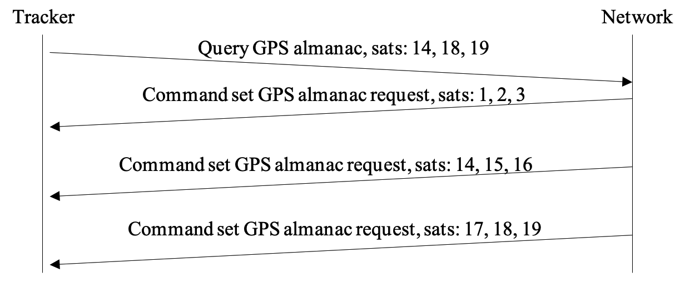
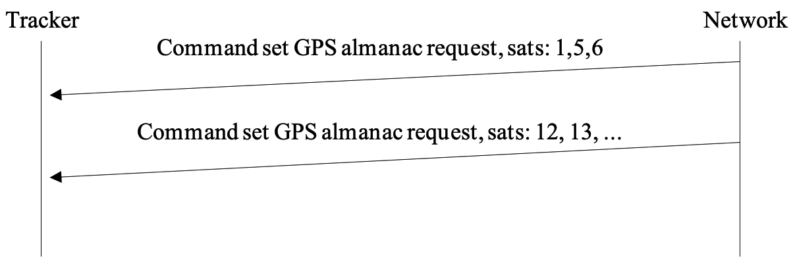

# GNSS manager

## Overview

The AT3 application contains a software subsystem called gnss-mgr.

This manager is responsible of:

-   Managing the almanac
    -   Monitoring the validity of the almanacs.
    -   Requesting an update through the network when the almanacs are
        out of date
    -   Updating the LR1110 and MT3333 almanacs
-   Managing the aiding position
    -   Monitor the aiding position (if moving during long time, then
        the aiding position may not be valid anymore)
    -   Request the aiding position via the network
    -   Update the aiding position

### Satellite identifiers

The satellite identifiers start at 1 regardless the device type (MT3333
or LR1110) and the constellation. The manager adapts it regarding the
device it addresses (For the LR11xx, the first GPS satellite is 0, for the
MT3333 it is 1).

### GNSS chip used

The manager checks whether a given GNSS chip is used (LR1110 and/or
MT3333). To do this, it checks the technologies defined in the GBE
profiles. All GBE profiles are parsed regardless of the geolocation
actually uses them.

An unused device is not managed (neither almanac monitoring nor
updating).

***Note regarding the MT3333***

It has been observed that a partial almanac update removes the existing
entries.

For this reason, the manager maintains a local image of the GPS almanac
using the LR format.

This image will used to perform a full update of the MT almanac.

***Terminology used***

-   Refresh: Process which reads the almanac from the devices and update
    the validity.
-   Request: Process which sends almanac requests toward the network.
-   Update: process which updates the device almanac

## Almanac management

The manager maintains the validity of the almanacs (GPS and BEIDOU) for
the devices used (LR11xx and GNSS).

### Refresh process

The almanacs are read at the start time and once a day. When the refresh
operation is performed, the outdated (last refresh date \< now() -- 60
days) entries count per GNSS chip and per constellation (called
validity) is updated.

The local almanac image is updated with the entries read from the GNSS
chips.

When the two GNSS chips are used, the process always starts by the
LR1110 and continues with the MT3333.

At the end of the refresh operation, the number of outdated entries of
the almanacs are compared against the acceptable configured ratio. If
this number exceeds the ratio, the almanac update process starts.

***Notes***

-   The current firmware supports only the GPS almanac update (BEIDOU
    will be added in a later release).
-   If a change in the use of a device occurs via the configuration, the
    manager starts the almanac refresh process.
-   Use of the 2 devices: since the LR11xx is not able to update its own
    almanacs, the MT GNSS is for now the only source of local almanac
    updates.
-   The almanac monitoring period is fixed to 1 day and is based on the
    system device monitoring period.

### Request and update process

***Update process initiated by the device.***

Once the almanac has been read and updated locally from the GNSS chip
(if this chip is enabled in any profile), the process checks the
outdated almanac entries per device and per constellation.

Note that the current firmware supports only the GPS almanac update.

If the number of outdated entries is greater than the configured ratio,
the update process starts.

The first action is to determine which entries needs to be updated. The
process maintains the variable

gps_needed_entry for this purpose, which is built before each network
request. This variable is simply a copy of the gps_outdated_entry of the
used device. If the two devices are used, the gps_needed_entry will be
the copy of the MT device since this one can automatically update its
almanac via the satellites and so entries will be fresher than the LR
ones.

The request is sent towards the network and a timer is started for 120
seconds. If the timer elapses, the process is aborted and state update is
entered if at least one almanac entry has been received.

The almanac answer (or a command) can be received asynchronously at any
time. In this case the local cache is updated and an another request is
done if there are still missing entries to reach the target validity
ratio.

Keep in mind that each request targets a maximum of 3 satellites.

After all responses have been received, the process transitions to the updating state. At this stage, the device's almanac is updated using data from the local almanac cache.

When both geolocation chips are used, the update begins with the LR1110 device and completes with the MT3333 device.

Once an entry is successfully written to a device, the manager updates the corresponding outdated bitmap for that device and its constellation.

At the end of the update process, the manager schedules the next refresh for 24 hours later.

The diagrams below show the two types of messages

***Using the answer downlink***

***Using the command downlink***

***Update process initiated by the network***

At any time the network may decide to update the almanacs using a
command. For example, this decision can be taken on the reception of the
status message or when receiving an almanac update request.

The process is identical than the one initiated by the device, except
that the command may contain up to 15 almanac entries (tuned to fit the
network capability. Once the set GPS command is processed, the device
may request missing entries.

The message diagram is simply:

**Special case for LoRaWAN**
LoRaWAN Class A requires an uplink transmission to trigger a downlink. It is uncommon for the network cloud to respond to a tracker’s request within the two RX windows immediately following the uplink. Consequently, an additional uplink is necessary to initiate the downlink transmission.

Since the GNSS manager has no knowledge of when this uplink will occur, a smart mechanism has been implemented to handle this scenario. Once the first uplink request is sent, the system temporarily modifies the downlink trigger interval. Normally, this interval periodically sends an empty downlink to enable reception. However, after an uplink request, the timer is adjusted to 20 seconds (a fixed, hardcoded value). This ensures that within the 120-second waiting period, at least one additional uplink is transmitted. Once the empty downlink is received, the system restores the downlink trigger period to its predefined value.

