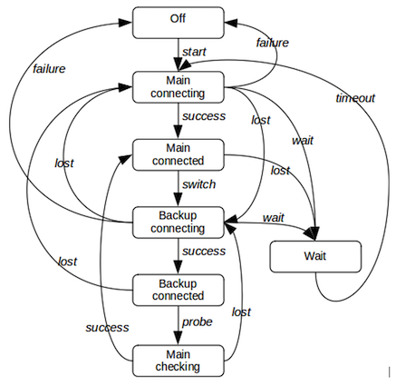
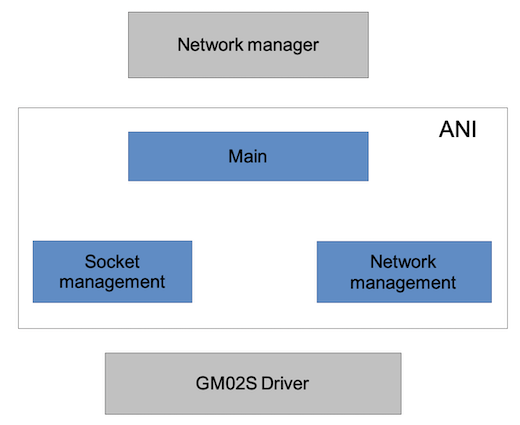
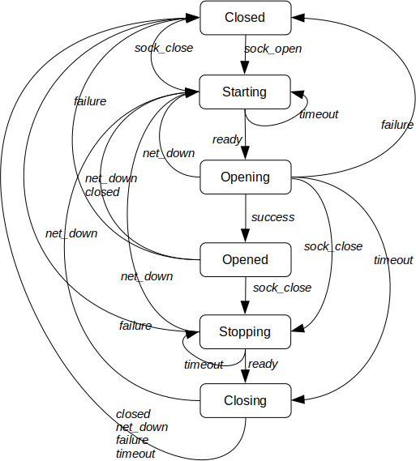
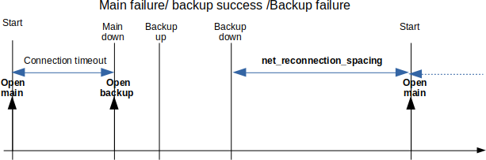

# Networking

## Overview

The networking part can handle both LoRa and cellular based networks. It
is designed as follows:

## Network manager

The network manager drives the LoRaWAN or the cellular ANI in term of
connectivity. The cellular and LoRaWAN networks cannot be active at the
same time due to antenna sharing.

The network connectivity management is built around a FSM.

***Operations***

The network connectivity is managed differently based on the
*net_type_selection* parameter:
-   lorawan_only: The network manager uses only LoRaWAN. It never
    switches to the cellular network
-   cell_only: The network manager uses only the cellular network. It
    never switches to LoRaWAN
-   lorawan_fallback_cell: The network manager uses LoRaWAN by default.
    In case of LoRaWAN network loss, it switches to the cellular
    network. LoRaWAN is considered as the main network, while the
    cellular is considered as the backup network.
-   cell_fallback_lora: The network manager uses the cellular network by
    default. In case of network loss, it switches to the LoRaWAN
    network. Cellular is considered as the main network, while LoRaWAN
    is considered as the backup network.

When the manager is in fallback mode (backup network active), it
temporarily suspends the network operations and attempts to reconnect
the main network.

***FSM states***

-   **Off**: Network manager is down.
-   **Main-connecting**: The connection to the main network is in
    progress
-   **Main-connected**: The main network is connected
-   **Backup-connecting**: The connection to the backup network is in
    progress
-   **Backup-connected:** The backup network is connected
-   **Main-checking**: The backup network is suspended. The network
    connection manager tries to reconnect the main network.
-   **Wait**: Wait for the end of the inter-connection duration

***FSM events***

-   *start*: Start the networking.
-   *failure*: Unrecoverable failure (SIM error for example in case of
    cell-only). In case of both networks used failure is generated only
    if both networks have unrecoverable failure.
-   *lost*: Network lost or fails to connect (recoverable failure)
-   switch: Switch between the main and backup network. This event is
    generated when the main network is lost and the network switching is
    allowed by configuration. If not allowed to switch, this event is
    not generated and a lost event is sent to the FSM.
-   *probe*: Start the main re-connection.
-   *wait*: Inter-connection spacing requested. This event is sent only
    if the connection spacing timeout is configured and when:
    -   There is no backup network defined or in permanent error.
    -   We are in **backup-connecting** state (meaning that the main
        network failed), and the backup network also fails.
-   *timeout*: connection spacing timeout

***FSM diagram***

 

### Application message routing

The network manager offers data several pipes to the application. It
maps a given data pipe to a given cellular UDP/TCP socket or a LoRaWAN
"socket".

## Cellular ANI

The cellular ANI performs the following tasks:

-   Drives the cellular driver (Sequans GM02s module supporting both
    LTE-M and NB-IOT).
-   Manages the cellular connectivity (configuration, network
    attachment/detachment,).
-   Manages the UDP/TCP sockets
-   Manages the messages received from the LTE network and forwards them
    to the network manager.
-   Manages the messages sent by application (via the network manager)
    and forwards them to the network.

***ANI design***

The interface with the Network manager is based on direct call from the
Network manager to the ANI and notification from the ANI to the Network
manager is done via a callback.

***ANI operation***

-   The Network manager opens the ANI for LTE connectivity
-   The request is forwarded to the socket management
-   The socket manager opens the cellular network management
-   The connection management forwards the connectivity result to the
    socket management
-   On connection success, the socket management opens its socket(s) and
    informs the Network manager of the success.
-   On connection failure, the socket management informs the Network
    manager of the failure.
-   Once connection is established and a network failure is reported by
    the connection management, the socket management closes its
    socket(s) and informs the Network manager.

### Main part

The main part of the ANI drives the network management and the socket
management.

### Network management

The cellular network requires a SIM card containing information about
the LTE operator, credential and services. Depending on the Abeeway
hardware platform, up to two SIMs are available:

-   SIM0 connected to the GM02S on the SIM slot 0

-   E-SIM connected to the GM02S on the SIM slot 1

The SIM0 is the usual SIM card provided by the LTE operator that we plug
in our mobile phones. A dedicated hardware socket is available for this
purpose.

The E-SIM is an embedded SIM welded on the hardware board (if mounted).
This SIM has a unique identifier called ICCID (Integrated Circuit Card
Identifier), which should be registered against the E-SIM provider. The
provider will grant the different operators and services that the system
can access.

#### Cellular connection management

***Overview***

The main ANI part controls the cellular network (open and close).

The modem notifies (unsolicited notification) the status of the
connection as well as its establishment. This notification is the CEREG
URC, which contains the following status:

-   0: No search
-   1: Registered against the home network
-   2: Searching
-   3: Registration denied
-   4: Out of network coverage
-   5: Connected via roaming
-   80: Network temporarily lost.

When using a eSIM, It has been observed that there are multiple CEREG
notifications, indicating probably the internal state of the modem
particularly when it switches from different operators and bands. In
this case CEREG status 0, 2, 3 and 4 can occur during the network
search. Due to this, the cellular connection management cannot directly
rely on all CEREG notification.

The cellular connection management enables the SIM status unsolicited
notification, which provides the following states:

-   0: No SIM card detected.
-   1: SIM under initialization
-   2: SIM locked (PIN or PUK required)
-   3: SIM invalid
-   4: SIM card failure
-   5: SIM card ready
-   6: PH-NET pin required
-   7: Phone-to-SIM password required
-   8: Invalid SIM card in PS (Packet Switched) domain
-   9: Invalid SIM card in PS (Packet Switched) and CS (Carrier
    Switched) domain
-   10: Invalid SIM card in CS (Carrier Switched) domain

The cellular connection management is based on a finite state machine
(FSM) described below. It is driven by the main part of ANI.

***Contextual variables***

-   state: Current state of the FSM
-   timer: Timer used by the FSM
-   reason: Disconnection reason.
-   connected_once: Boolean indicating whether cellular network has been
    connected at least once.

***FSM states***

-   Off: The modem is shutdown
-   Connecting: The modem is attaching to the network.
-   Get_time: Request the UTC time to the network.
-   Connected: The modem is attached to the network.
-   Disconnected: The network has been lost.
-   Disconnecting: The modem is being disconnected.
-   Suspending: The modem is being suspended.
-   Suspended: The mode is suspended.

***FSM events***

-   *open*: Administrative event sent by the network manager to open the
    cellular connection or when the suspended state should be left.
-   close: Event sent by the network manager or by the ANI itself if
    there are no more sockets open.
-   *timeout*: Timer elapsed.
-   *success*: Successfully connected and attached to the network (Got
    CEREG 1 or 5).
-   *get_time*: Get time request successfully answered.
-   *lost*: Network temporary lost (CEREG=80).
-   *closed*: Sent to the FSM once the disconnection is complete
-   *abort*: Abort requested by the manager to shutdown the network (non
    graceful close).

***State diagram***

***Notes***

-   In the state Connecting: Each *timeout* event reset and restart the
    GM02S and increases the attempts counter. After n attempts, the
    *abort* event is generated.
-   In the state Get_time, if the network has been connected at least
    once, the state is skipped.
-   In the state Get_time, the request can be sent up to 3 times. The
    ***timeout*** event for this state is generated each 15 s. If the
    request definitely fails after 3 attempts, the FSM moves in the
    connected state (since there can be other sources to get the UTC
    time, e.g LoRa or GPS).
-   In the state Connected, if a lost event occurs, the timer is started
    letting time for the modem to recover the network. When it elapses,
    the event timeout is generated.

#### Cellular socket management

The socket management is built around a finite state machine (FSM)
described below. The FSM is replicated for each configured sockets.

We remind that the GM02s driver is able to process one socket at a time.
So the cellular socket management should serializes the opening/closing
socket requests.

The cellular network management sends the *sock_open* to the socket FSM
whenever the cellular network manager enters the Connected state and
sends the *net_down* event whenever the network manager reaches the Off
state.

***FSM states***

-   Closed: The socket is closed.
-   Starting: The socket should be open and is waiting for either the
    network up or the GM02S ready to send socket requests.
-   Opening: The socket is being opened.
-   Opened: The socket is open. Data traffic can flow
-   Stopping: The socket should be close and is waiting for the GM02S
    ready to send socket requests.
-   Closing: The socket is being closed.

***FSM events***

-   *sock_open*: Event issued to open the socket
-   *sock_close*: Either an administrative close request has been issued
    either by the above-layer/configuration or due to a failure.
-   *ready:* Event issued when the network is up or when the GM02S is
    ready to accept requests.
-   *net_down*: Event issued by GM02S driver indicating that the network
    is down.
-   *success*: Event triggered by the GM02S driver indicating that the
    socket opening is successful.
-   *failure*: Event triggered by the GM02S driver indicating that the
    socket opening failed or if the socket has been remotely closed or
    if a driver socket related error occurs.
-   *closed*: Event triggered by the GM02S driver indicating that the
    socket is closed.

***FSM diagram***

***Notes***

-   The *ready* event is sent by the Network FSM when it reaches the
    connected state.
-   The *net_down* event is generated by the Network FSM when the state
    Off is entered.
-   In state Opened, the data traffic can flow if and only if the
    network FSM is in state Connected.
-   Only one socket gets the *ready* event at a time.
-   The *net_down* event is sent to all sockets.

***Dynamic configuration***

To be properly configured the socket should have at least the
destination IP/URL address and the destination port.

When configured and the network opened but not connected, the socket
goes in state starting and remains in this state until the network is
reachable.

When the network is connected and the socket is unconfigured (port = 0
or IP address empty), the socket moves to the close state. In addition
if there is no more sockets opened, the network is shutdown.

***Transmission over a socket***

Each socket has its own transmission queue handling up to 5 messages.

In order to optimize the power consumption, the actual transmission
follows the rules:
-   Send ASAP if the network is connected and the modem is active (not
    in deep sleep).
-   Postponed by the TX aggregation timer if the network is connected
    and the modem is sleeping and the transmission queue is not almost
    full (less than 4 buffers)
-   Send ASAP if the network is connected and the queue is almost full
    (greater than or equal to 4 buffers including the new one)
-   Send ASAP when the aggregation timer elapsed and the network is
    connected
-   Postponed until recovery if the network is disconnected.

*Note*

-   When the opportunity of transmission occurs, all buffers are sent.
-   When the transmission queue becomes full (can arise if network
    disconnected), the oldest message is removed from the queue.
-   Each socket has its own TX aggregation timer (and configuration)

## LoRaWAN ANI

The LoRaWAN ANI controls the LoRaWAN part of the LR1110. It sits on the
top of the LoRaWAN service. As of today, only the LoRaWAN class A is
supported. Next releases will address also class B.

### ANI operation

-   Attach to the LoRaWAN network (Join sequences).
-   Leave the network (useful when LTE is also present on the board).
    Note that both LTE and LoRa cannot run at the same time (antenna
    sharing).
-   Support multiple lora-sockets. Each sockets are characterized by a
    specific UL port and a specific DL port. The term lora-socket (which
    is not an usual UDP/TCP socket) is generalized by analogy to TCP/IP
    over LTE.
-   As LTE, each lora-socket has it own queue to send traffic (uplinks).
-   Support multiple type of transmission strategies (ADR, random,
    custom, and so on)
-   Support single or dual transmissions.
-   Probing the network once joined
-   Send periodic empty uplinks to trigger downlinks.

### Network probing

A non-null value of parameter lorawan_probe_max_attempts starts the
LoRaWAN network probing. One the duration lorawan_probe_period is
reached, a link-check request is sent. Once the number of max attempt is
reached, the network is considered as lost.

If network probing fails, the ANI attempts to rejoin.

### Join process

AT3 uses the LBM randomization and datarate distribution (which consists
of an array of 16 entries). Each entry is a datarate. The LBM selects
randomly one entry at a time. Once used, the entry is tagged to avoid
reusing it. AT3 fills the array as follow:

-   Non US915 regions: The sequence \{DR0, DR1, DR2\} is repeated 5 times.
    The last entry is set to DR0.
-   US915: The sequence \{DR0, DR0, DR0, DR0, DR0, DR0, DR4\} is repeated
    twice. The last entry is set to DR0.

During this process, a connection timer may be started (parameter
lorawan_cnx_timeout not null). Once the timer elapses, a timeout event
is sent to the FSM and a LoRa leave is done.

The ANI is built around the following FSM.

***FSM states***

-   Shutdown: Network not joined.
-   Joining: The join process is in progress.
-   Idle: Network joined but not accessible (e.g. LTE is active).
-   Active: Network accessible (joined and no LTE).

***FSM events***

-   *start*: Start the join process or resume the LoRa activity
-   *suspend*: Suspend LoRa
-   *timeout*: Timer expiry
-   *failure*: Unrecoverable failure (no LoRa socket)
-   *success*: Join success
-   *lost*: Network probing failure.
-   *abort*: Leave and stop the network.

***FSM diagram***

*Note*

The *timeout* event in the active state is triggered by the network
probing timer, which triggers a link-check request.

## Operational modes and configuration

This section covers the networking configuration as well as the
operational modes. Relevant configuration is handled by the dedicated
configuration groups. Note that in case of non LTE capable trackers, the
cellular configuration group is not accessible and the network group has
a reduced parameter set.

### Configuring LoRaWAN

LoRaWAN is configured via the LoRa parameter group. The relevant
parameters are:

-   **net_selection**: Network selection has the value 0 (LoRa only).
-   **net_reconnection_spacing**: Duration in seconds between the
    network down detection and the reconnection with a new join attempt.
-   **lorawan_cnx_timeout**: Maximum duration for successfully joining a
    LoRaWAN network. Once this delay expires, the LoRaWAN network is
    considered as down. A null value will let the join mechanism running
    indefinitely. To emulate an Asset-tracker II behavior, this
    parameter should be set to 0. In that case, only the LoRa join
    duty-cycle will space the different join attempts.
-   **lorawan_dl_trigger_period:** Value in second used by a dedicated
    timer. Once the timer elapses, an empty uplink is sent to trigger an
    eventual downlink. A value of 0 disables this timer. The timer is
    restarted each time any uplink is sent.
-   **lorawan_probe_max_attempts**: Number of link-check requests sent
    before declaring the LoRa network down. Note that, the link-check
    mechanism is started only if the network has been joined.
-   **lorawan_probe_period**: Duration between 2 link-check requests.

Note that the l*orawan_probe_max_attempt*s \* *lorawan_probe_period*
represents the maximum time during which the LoRa network will be
unavailable. Once this duration elapses, the network is left and
considered as down. The network manager will reconnect the LoRaWAN
network if needed. The reconnection will restart with a join sequence.

The following diagrams provide the different timings.

 

### Configuring the cellular network

The cellular network is configured via the cellular parameter group. The
relevant networking parameters are:

-   **net_selection**: Network selection has the value 1 (cellular
    only).
-   **net_reconnection_spacing**: Duration in seconds between the
    network down detection and the reconnection.
-   **cell_cnx_timeout_static**: Duration in second to connect to the
    cellular network when the tracker is static.
-   **cell_cnx_timeout_motion**: Duration in second to connect to the
    cellular network when the tracker is in motion.
-   **cell_cnx_max_attempts**: Maximum number of attempts to connect to
    the network before indicating a network lost to the network manager.

The following timing diagram shows the connection processing.

 

### Configuring main and backup networks

In this configuration, the two networks are configured. The setting of
the **net_selection** parameter indicates which network play the roles
of the main and backup network.The generic behavior is the following:

-   The connection manager tries to connect to the main network.
-   In case of the main network failure, the connection manager attempts
    to connect to the backup network.
-   If both network fails to connect, the network manager waits for the
    **net_reconnection_spacing** duration and retries to connect to the
    main network.
-   At the time the connection manager switched to the backup network,
    the main network probing will take place. After each
    **net_main_probe_timeout,** the network manager suspends the backup
    network, and attempts to reconnect to the main network.
    -   If the main network connection successes, the main network is
        kept as the active network.
    -   Otherwise, the network manager resumes the backup network and
        restart the probing timer.

Note that during the main network probing, the connectivity is suspended
(The application cannot send payloads).

LoRaWAN and the cellular network should be configured as described in
the previous sections. Additional parameters are:

-   **net_selection**: The network selection has the value:
    -   2: LoRa is the main network and cellular is the backup one.
    -   3: Cellular is the main network and LoRa is the backup one.
-   **net_reconnection_spacing**: Duration in seconds between the
    network down detection and the reconnection. Used only in the case
    where the two networks fail to connect.
-   **net_main_probe_timeout**: Duration in seconds between each main
    network probe attempts. This duration is used when the active
    network is the backup one.

