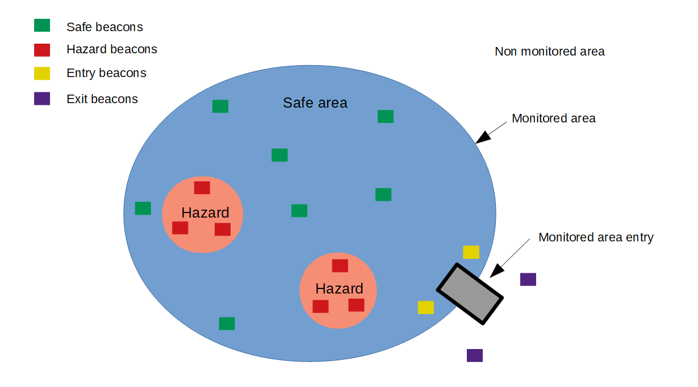

# Functioning

## High level features

This section describes the high-level features of AT3 V1.2 release.

-   **Main LoRaWAN features**
    -   Class A
    -   Support for all main regional parameters (EU, AS, IN, AU, US)
    -   Network access: OTAA
    -   Network monitoring (Link check, Reset on prolonged network loss)
    -   Multiple transmissions strategies (configurable ADR, Dual transmissions)
    -   Configurable confirmed uplinks
    -   Uplink queue (Up to 8 messages)
    -   Downlink messages processing
    -   Configurable heartbeat
    -   Synchronization to network time

-   **Main Cellular LPWAN features**
    -   Support for NB-IoT and LTE-M
    -   Support for physical SIM and eSIM
    -   Support for PSM and eDRX modes
    -   Configurable heartbeat
    -   Network time synchronization
  
-   **Geolocation**
    -   Configurable multi-technology (GNSS, LP-GNSS, BLE, WiFi) geolocation profiles based on triggers (button press, SoS, etc)
    -   BLE positioning using beacon type (Eddystone, Altbeacon, iBeacon) & beacon identifier filtering
    -   Configurable timing for geolocation (timeout, LoRaWAN reporting)

-   **BLE inventory management/BLE scan collection**
    -   Reporting of upto 20 BLE beacons using beacon type & beacon
        identifier filtering

-   **SOS support**
    -   Specific UI to indicate SoS
    -   Configurable geolocation behaviour during SoS mode

-   **BLE connectivity**
    -   Single bonding support
    -   Passkey authentication support
    -   Export standard characteristics (temperature, battery, ...)
    -   Export vendor specific characteristics (parameters, mode change,
        ...)
    -   Notification support (send notifications to mobile phone)
    -   BLE firmware update over the air
    -   MCU firmware update over the air
    -   CLI over BLE
    -   Find me support
    -   Tracker stops geolocation/collection when securely connected.
    -   Behavioral profile support

-   **BLE beaconing**
    -   Configurable beacon transmission (Eddystone, Altbeacon, iBeacon & Quuppa)

-   **Device management**
    -   CLI interface (Support multiple commands, two access levels)
    -   Log facility (Per module log)
    -   Accelerometer management (Motion and shock detection)
    -   Temperature management (Permanent storage of the min/max values,
        actions taken when min/max thresholds reached)
    -   Battery management (Primary vs rechargeable batteries, remaining
        capacity measurement, and estimated consumption).
    -   Configuration parameters management (Permanent storage,
        Configuration files and Parameter identifier parser)
    -   Startup modes
    -   Firmware update over USB.
    -   Firmware update over BLE

## Startup process

The devices are stored in ***Shipping Mode***, a low-power state designed to preserve the batteries. LPWAN networking is disabled in *Shipping mode*. If they have been provided in *Shipping Mode*, the trackers need to be activated (with a button press sequence, or a magnet depending on the device). In-factory pre-activation of devices is available as an ordering option.

After activation the tracker is will attempt to connect to a LPWAN network as configured in the Network configuration parameters. If multiple LPWAN network technologies have been configured, the tracker will first attempt to connect to the primary network, and then the secondary. For more information, please refer to [Networking](./networking).

In its default configuration, the tracker will enter *Active State* and perform geolocation fixes as determined by the geolocation manager configuration. Optionally, the tracker may be configured to enter *Active State* only after a first successful connection to a LPWAN network (network trigered activation is an ordering option).

Startup process main steps:

1.  If the device is in the shipping state, it waits in low power mode for a long button
    press or for a magnet activation sequence.
1.  Afer detecting the activation sequence, the tracker attempts to connect to a LPWAN network.
1.  Once connected to a LoRaWAN or Cellular network, the tracker starts reporting of positions.

:::tip Note
For special orders, it is possible to specify delivery in "Join-then-activate mode":
- The device sends periodic LoRaWAN join uplinks (with exponential back-off retries, so energy usage remains low)
- BLE connectivity is activated (so a user may use the BLE command line interface for configuration).
After the device has successfully joined a network, the application starts automatically (active state).
This "Join-then-actvate mode" is useful for consumer products to avoid any manual action to activate the device, which is entirely controlled by the presence of a valid LoRaWAN network subscription for the device.
After the device has been activated a first time, the application remains active and will not stop even if LoRAWAN connectivity is lost and the device goes to Joining mode again.
:::

## Geolocation

This section describes the high level geolocation features of the tracker. For more details, please refer to [Geolocation
manager](./geoloc-manager).

### GNSS

The tracker features a multi-constellation GNSS chip compatible with GPS, GLONASS, Galileo, and BeiDou systems. When utilizing GNSS for geolocation, the device's uplink payload includes its GPS coordinates, along with estimated location accuracy, heading, and speed.
It's important to note that GNSS position acquisition and tracking are energy-intensive processes. To manage this, the AT3 multi-technology geolocation engine offers various configuration parameters. These settings allow for fine-tuning of triggers for new fixes and help balance the trade-offs between energy consumption, fix latency, and accuracy.
For more information, please refer to [GNSS manager](./gnss-manager).

### Low-Power GNSS

The tracker also supports Abeeway proprietary Low-Power GNSS (LP-GNSS). With LP-GNSS, the onboard GNSS processing is limited to the acquisition of GNSS pseudoranges. A patented technology combines pseudoranges, network time and cloud based processing to obtain a fix. LP-GNSS has an extremely low power consumtion compated to full GNSS, and also provides faster time-ti-first fix (TTFF) in case of bad wheather conditions or during indoor-outdoor transitions. LP-GNSS, however, typically has lower accuracy than on-board GNSS, as it does not benefit from on-board averaging of positions.
LP-GNSS is optimal for use e.g. during vehicle motion as extreme accuracy is not needed, while full GNSS may be preferred for on-demand fixes, for example.
For more information, please refer to [GNSS manager](./gnss-manager).

This feature requires a subscription to ThingPark X Location Engine (TPX-LE).

### WiFi indoor/outdoor geolocation

The tracker supports scanning of WiFi MAC addresses which are reported to the customer's business application or ThingPark location. The WiFi MAC addresses can be used for indoor positioning using a network-based geolocation service.

This feature requires a subscription to ThingPark X Location Engine (TPX-LE), or a 3rd party WiFi location solver. For more information, please refer to [Geolocation Manager](./geoloc-manager).

### BLE indoor geolocation

The tracker supports scanning of BLE MAC addresses which are reported to the customer's business application or ThingPark location. The BLE MAC addresses can be used for indoor positioning using ThingPark location.

This feature requires a subscription to ThingPark X Location Engine (TPX-LE), or a 3rd party WiFi location solver. For more information, please refer to [BLE scan](./ble-scan).

### BLE geozoning

The BLE geozoning mode is used to track people or assets inside buildings, plants, or any other indoor area. It may also be used as a compement to GNSS, LP-GNSS and WiFi location to provide accurate location around anchor points, for example at specific reporting locations as part of a guard tour.

Anchor beacons must be placed inside the monitored building. The tracker can recognize the following beacon types:

-   Entry: These beacons are placed at the entrance of the monitored
    building.
-   Exit: These beacons are placed at the exit of the monitored
    building.
-   Safe area: These beacons are placed at the safe areas of the
    building.
-   Hazardous area: These beacons are placed at the hazardous areas of
    the building.
-   No beacon detection: When no beacons are detected inside the
    building, it is considered as a safe area.

The following picture describes the different type of areas.

:::tip Note
- This feature is not supported in AT3 1.3. It is planned in future firmware releases of AT3.
:::

## BLE beaconing

The tracker supports BLE advertising of standard beacon types (Eddystone, iBeacon, Altbeacon & Quuppa). Support for Quuppa beaconing enables precise location of Abeeway trackers through Quuppa angle-of-arrival location infrastructure. 
The beacon identifier can be configured using the firmware parameters. For more details on BLE beaconing, please refer to [BLE group](./configuration.md#ble-group).

## User interfaces

Depending on the tracker model, the application firmware user interface controls a buzzer/speaker, LEDs, and buttons. Please refer to section [user interface](./user-interface/) for more details.

## SOS 

SOS mode switches the device to a specific tracking mode. 
Once this feature is activated, the behavior is the following:

-   The tracker sends a **start SOS** event payload.
-   The tracker does geolocation as part of geolocation manager
    configuration
-   The tracker's UI can be configured to indicate that the tracker is
    in SoS mode (1).
-   The tracker will play a melody to indicate SoS mode (1).

## Motion detection

This feature is supported by all Abeeway trackers.

The tracker embeds a three axes accelerometer, which detects
accelerations and triggers motion events. It is configurable with the
following parameters:
-   **accelero_motion_sensi**: This parameter configures the sensitivity
    of the accelerometer.
-   **accelero_motion_duration**: This application firmware generates
    [motion end notification](./application-uplink#class-accelerometer) once this timer
    elapses after the tracker stops moving.
-   **accelero_full_scale**: This parameter affects the measurement
    range of the accelerometer. Lower values give extremely sensitive
    and accurate measures but are capped rapidly, while higher values
    are less accurate but are capped at higher values. Consequently, the
    lower values should be used in the case of motion detection if high
    sensitivity is required (e.g. to detect movement of freight in a
    high speed train), while higher values will be reserved for shock
    detection. Human motion (e.g. wearing a badge) will be detected
    reliably at all scales.
-   **accelero_output_data_rate**: This parameter affects the sampling
    rate of the accelerometer. The setting of this parameter will
    affect:
    -   **Power consumption**: Lower values will minimize power
        consumption. Ultra-low power operation requires use of 12.5Hz
        output data rate (ODR).
    -   **Accuracy**: Higher values will provide more sensitivity to
        transient events. Shocks which last less than 1/ODR seconds may
        go unnoticed. ODR acts as a low pass filter, so the vibration\'s
        measured energy will decrease at low ODR frequencies.

When configuring the tracker only for motion detection, accuracy is not
an issue since we are only interested by the movement. So, it is advised
to use the lowest value of *accelero_output_data_rate*. However, when
shock detection is used, if very short duration shocks are expected,
higher values of *accelero_output_data_rate* may be needed. In general
shocks between "soft" objects at low speed will last more than 1/10s and
the lowest *accelero_output_data_rate* will work. Vice versa high speed
shocks between hard objects may have extremely short duration.

For more information, please refer to [Accelerometer
group](./configuration#accelerometer-group).

## Shock detection

This feature is supported by all Abeeway trackers.

This feature enables the reporting of the shocks detected by the
tracker. The shock detection threshold is configured using
*accelero_shock_threshold*. Once the tracker detects the shock, it
generates shock detection notification message.

For more information, please refer to [Accelerometer
group](./configuration#accelerometer-group).

## Notification Messages

Notification messages are supported by all Abeeway trackers.

These messages are notifications sent by the tracker informing the
application server about specific events. These events can be system
related (for ex. Low battery) or application specific (for ex. Trigger
of SoS).

Refer to the section [Notifications](./application-uplink#notifications) for the format of
the notification uplinks.

## Temperature monitoring

This feature is supported by all Abeeway trackers.

This feature is designed to report temperature events when the
temperature measured by the device is above or below the configured
thresholds, *core_temp_high_threshold* and *core_temp_low_threshold* in
°C. The temperature hysteresis is configured using
*core_temp_hysteresis* to avoid too many uplinks due to frequent
temperature changes. The configuration of these parameters is explained
in [System core group](./configuration#system-core-group).

The temperature notification uplink is described in Class *temperature*

## Power management

The tracker periodically reports its battery level and sends a system notification when detecting low battery level.

## LoRaWAN and Cellular network management

The tracker firmware supports the management of both LoRaWAN and cellular networks.

Note: Cellular network management is only valid for trackers embedding GM02S module. Combo cellular-LPWAN compact
tracker supports the cellular features of the firmware.

The network manager is responsible for:
-   Managing the network connectivity state.
-   Switching between the LoRaWAN or the cellular networks based on
    availability of the primary network.
-   Routing the application messages over a cellular or LoRaWAN network.

For more information on network management, please refer to
[Networking](./networking).

