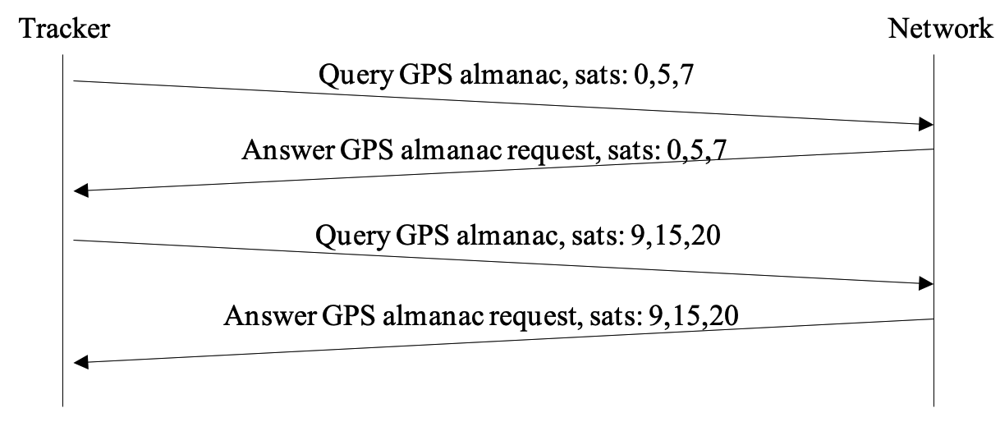

# GNSS manager

## Overview

The AT3 application **gnss-mgr** subsystem is responsible for:

- **Managing almanacs**
  - Monitoring the validity of GNSS almanacs (satellite orbital data used for positioning).
  - Requesting updates through the LoRaWAN or cellular network when almanacs are out of date.
  - Updating almanac data for the LR1110 and MT3333 GNSS chipsets.

- **Managing the aiding position**
  - Monitoring the aiding position (if the device remains in motion for an extended period, the aiding position may no longer be valid).
  - Requesting the aiding position via the network.
  - Updating the aiding position.

This section provides only a brief overview. For a comprehensive reference on GNSS/AGNSS processing logic and parameters, refer to [application note AN-016_GPS_LPGPS](<https://actilitysa.sharepoint.com/:f:/t/aby/Evqx0qp6AQ1OqrI7-2DoIxsB1wKjLBjykfPh2p7Lo8mP7g?e=pIglNa>).

## Almanac management
The manager maintains the validity of the almanacs (GPS and BEIDOU) for the devices used (LR11xx and GNSS).

### GNSS hardware in use
The manager checks whether a LR1110 and/or MT3333 gnss chip is in use by examining the technologies defined in the `geoloc_gbe_profileX_techno` profiles that have been configured ([parameter group 0x02](./configuration.md#geolocation-engine-group)). All GBE profiles are parsed, even if geolocation does not actually use them.  
Devices that are not in use are not managed (no almanac monitoring or updating is performed).

### Refresh of local almanac image

The manager maintains a local image of the GPS almanac in the LR1110 format, which is used to perform a full update of the underlying GNSS chips almanacs when needed. In this copy, satellite identifiers always start at 1, regardless of the hardware in use (MT3333 or LR1110) or the constellation. The manager adapts the identifiers as needed when addressing a given GNSS chip.

The almanacs are read at boot and then once per day from the MT3333 (currently LR1110 does not support local almanac decoding). The local almanac image is then updated.
The number of outdated entries — where the most recent almanac entry for a given satellite is older than 60 days — is counted per GNSS chip and per constellation. The result is provided as a bitmap as part of periodic [status messages](./application-uplink.md#system-status-notification) in order to allow a back-end application to proactively update the outdated entries using [almanac update downlink commands](./application-downlink.md#update-gps-almanac). it is also shown in the output of CLI command `gnss info`.

At the end of the refresh procedure, the percentage of outdated almanac entries is compared to the configured threshold defined by [parameter `core_almanac_outdated_ratio` (0x010D)](./configuration.md#system-core-group): if this threshold is exceeded, the almanac update process is triggered.

***Notes***

- The current AT3 firmware supports only GPS almanac updates. BEIDOU support will be added in a future release.
- If the device’s configuration changes (e.g., enabling or disabling GNSS chips), the manager starts the almanac refresh process.

### Request and update process

***Update process initiated by the device***

Once the almanac has been read and updated locally from the GNSS chip  
(if this chip is enabled in any profile), the process checks the number of outdated almanac entries per device and per constellation.

:::note
The current firmware supports only GPS almanac updates.
:::

If the number of outdated entries is greater than the configured ratio, the update process starts.

The `gps_needed_entry` bitmap has a bit set for each satellite with an outdated almanac. It reflects the outdated entries of the MT3333 chip which can automatically update its almanac from the gnss RF signals (therefore typically fresher than those of the LR1110 chip).

An [almanac request uplink](./application-uplink.md#update-gps-almanac) request (for up to 3 satellites at a time) is sent over the currently active network and a 120-second timer is started. The [almanac update answer](./application-uplink.md#response-to-a-get-gps-almanac-entry-request) (which is also a command) can be received asynchronously at any time.   
In this case, the local cache is updated, and another request is sent if there are still missing entries needed to reach the target validity ratio.
If the timer expires or after all responses have been received, the process transitions to the **updating** state.  
At this stage, the almanac in each GNSS hardware in use is updated using data from the local almanac cache. 
When both geolocation chips are used, the update starts with the LR1110 device and completes with the MT3333 device.

Once an entry is successfully written to a device, the manager updates the corresponding outdated bitmap for that device and its constellation.

At the end of the update process, the manager schedules the next refresh for 24 hours later.

The diagrams below show the two types of messages.

***Using the answer downlink***

***Using the command downlink***

***Update process initiated by the network***

At any time, the network may decide to update the almanacs using an  
[almanac update command](./application-uplink.md#response-to-a-get-gps-almanac-entry-request).  
For example, this decision can be triggered upon receiving the outdated almanac bitmap — which is periodically included in status uplinks — or after receiving an explicit almanac update request.

The process is identical to the one initiated by the device, except that the command may contain up to 15 almanac entries (optimized to fit within the current communication network's maximum transmit unit, or MTU).  
Once the update has been processed, the device may request any additional missing entries.

The message diagram is simply:

**Special case for LoRaWAN**
LoRaWAN Class A requires an uplink transmission to trigger a downlink. It is uncommon for the network cloud to respond to a tracker’s request within the two RX windows immediately following the uplink. Consequently, an additional uplink is necessary to initiate the downlink transmission.

Since the GNSS manager has no knowledge of when this uplink will occur, a smart mechanism has been implemented to handle this scenario. Once the first uplink request is sent, the system temporarily modifies the downlink trigger interval. Normally, this interval periodically sends an empty downlink to enable reception. However, after an uplink request, the timer is adjusted to 20 seconds (a fixed, hardcoded value). This ensures that within the 120-second waiting period, at least one additional uplink is transmitted. Once the empty downlink is received, the system restores the downlink trigger period to its predefined value.

