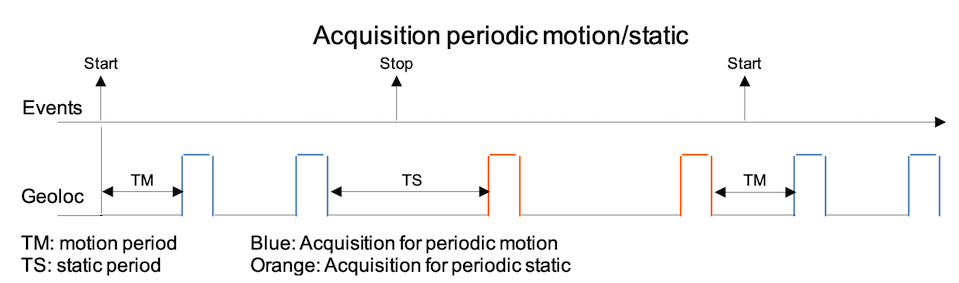
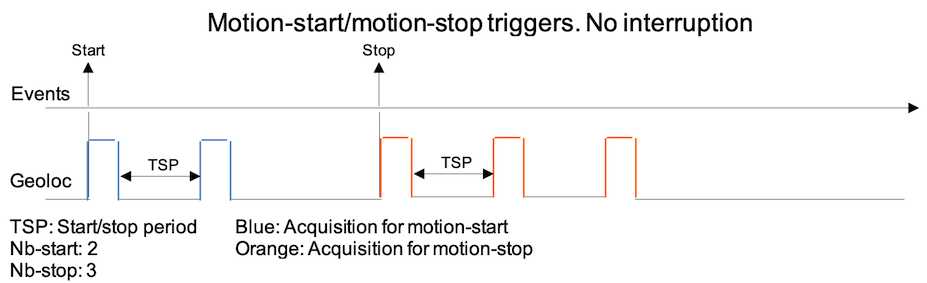
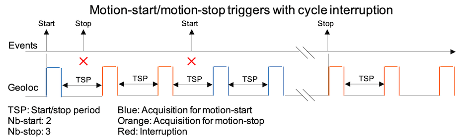
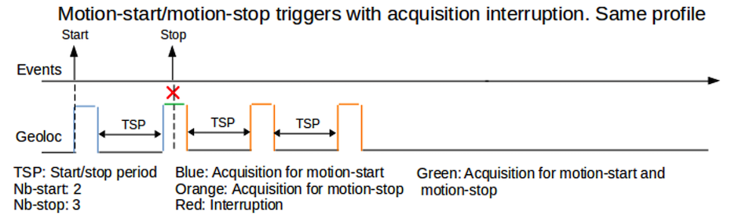
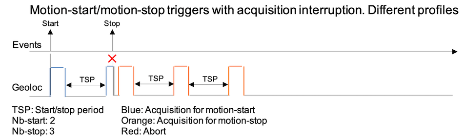
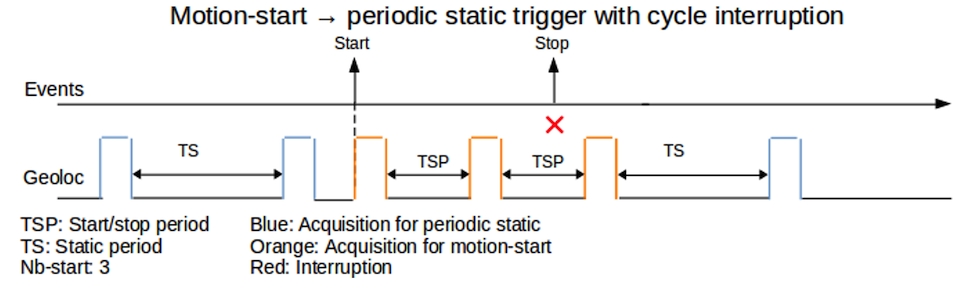
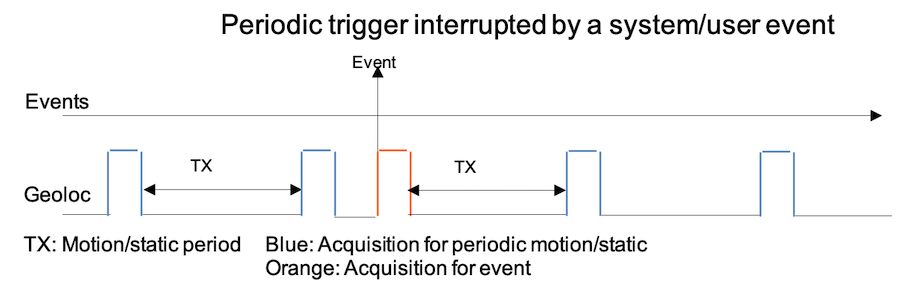
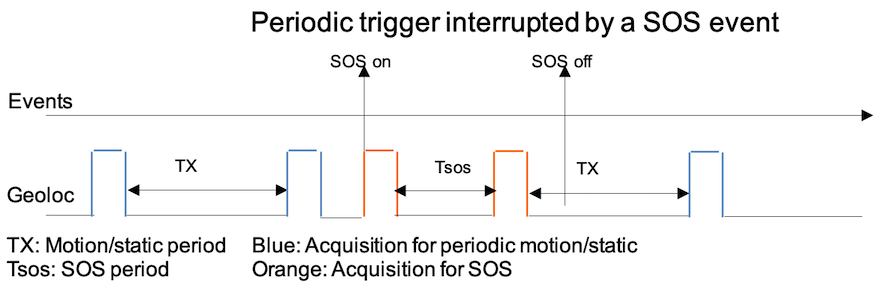
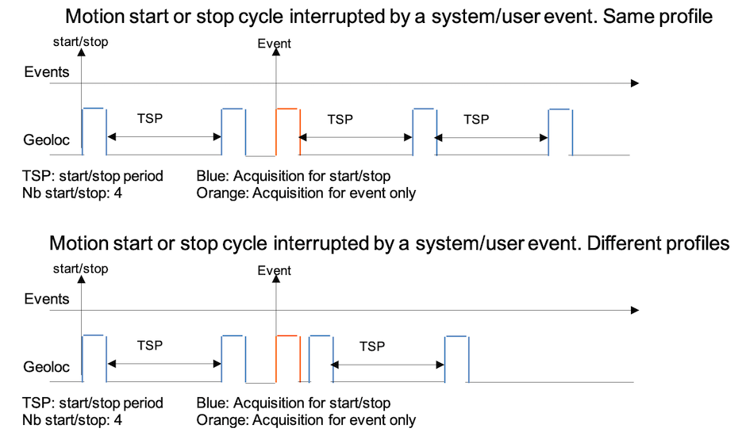
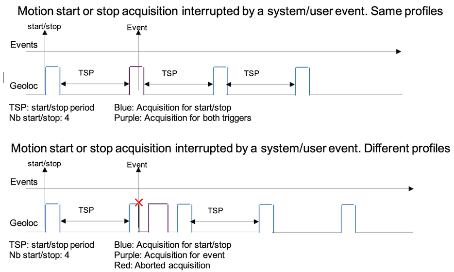

# Geolocation manager

AT2 defines an operational mode used to select the geolocation mode
(permanent, start/stop, motion, and so on).

AT3 does not use such a concept. Instead, it is event based: application
events trigger the geolocation activities.

The geolocation manager responsibilities are:
-   Handling the applications events defined as geolocation triggers and
    start accordingly the geolocation process.
-   Supporting the periodic position acquisitions including the SOS
    mode.
-   Performing consecutive position acquisitions if needed (for motion
    start or stop).
-   Managing the priorities between the requests due to the geolocation
    triggers.

## Configuration and behavior

This section is dedicated to the customers and the support. It
highlights the geolocation configuration of the manager and associated
behavior

### Configuration

The configuration is done using the configuration class 1 (geolocation).
It defines various periods for periodic (or semi-periodic) acquisitions,
counters for motion-start and motion-stop events, event triggers
profiles and GBE (Geolocation Basic Engine) profiles.

This paragraph focuses on the triggers and GBE profiles.

The event trigger parameters 0, 1 and 2, associated to the corresponding
geolocation profiles 0, 1 and 2 define the list of events for which a
geolocation activity should be performed. The geolocation activity will
be profiled by the matching profile which define the technologies to use
and their sequencing.

An event trigger is a bit-field containing the list of events that
should use the same profile. The bit definitions are:

-   bit 0: geo_trigger_pod: Geoloc triggered on Position-on-demand via
    downlink or via button.
-   bit 1: geo_trigger_sos: SOS started
-   bit 2: geo_trigger_motion_start: Geoloc triggered on motion start
    event
    -   Require the configuration of geo_start_nb_loc and
        geo_start_stop_loc_period
-   bit 3: geo_trigger_motion_stop: Geoloc triggered on motion stop
    event
    -   Require the configuration of geo_stop_nb_loc and
        geo_start_stop_loc_period
-   bit 4: geo_trigger_in_motion: Periodic geoloc while the tracker is
    in motion
    -   Require the configuration of geo_motion_loc_period.
-   bit 5: geo_trigger_in_static: Periodic geoloc running while the
    tracker is static
    -   Require the configuration of geo_static_loc_period.
-   bit 6: geo_trigger_shock: Geoloc triggered on shock action
    -   Require the shock detection configured (accelerometer)
-   bit 7: geo_trigger_temp_high_threshold: Geoloc triggered on
    temperature high.
-   bit 8: geo_trigger_temp_low_threshold: Geoloc triggered on
    temperature low.
-   bit 9: geo_trigger_geozoning: Geoloc stopped while in monitored
    area. Enabled when leaving the monitored area.

### Event priority groups

Each event belongs to a priority group. This priority is used by the
manager to properly schedule (or abort and reschedule) the geolocation.
The priority is based on the nature of the event and not on the profile
it is defined.

The priority groups are hard-coded and defined as follow:

| **Priority** | **Events**                                                   |
| ------------ | ------------------------------------------------------------ |
| 0 (lowest)   | Periodic events group (moving, static)                       |
| 1            | Motion events group (motion-start and motion-end)            |
| 2            | User event group (POD, shock detection). Non critical events |
| 3            | System event group (Temperature low/high)                    |
| 4            | SOS group                                                    |
| 5            | Geozoning.                                                   |

***Notes***

-   If a given event is defined in two profiles, the geolocation profile
    used for this event will be the one of the profile having the lowest
    identifier. This means that a given event can have only one
    geolocation profile.

> Example: Both geoloc_profile0_triggers and geoloc_profile1_triggers
> have geo_trigger_pod bit set (bit 0), the geolocation profile used for
> a POD will be geoloc_gbe_profile0_techno.

-   In the rest of the document, we use the term:

    -   **periodic events** for *in_motion*, *in_static* events and
        *sos* events.
    -   **semi-periodic events** for *motion-start* *motion-*stop.

### Behavior for cases involving interactions between events

The main objectives of the geolocation manager are:

-   To respect the event priority. An event with a higher priority takes
    precedence regarding the geolocation over a lowest priority.
-   Avoid having more than necessary geolocation acquisitions: If an
    event B occurs while an acquisition is in progress for an event A
    and both have the same profile, don't abort the current acquisition
    (event if event B has higher priority). Instead, indicate that the
    geolocation result relates to both triggers.
-   To manage properly extra-positions for motion-start or motion-end
    events: When the multiple acquisitions are in progress for a motion
    event (start or end) and the opposite event occurs the multiple
    acquisition stops for the previous event (and may restart for the
    opposite event if configured for).
-   To avoid having no geolocation when periodic triggers are in use
    (this case may occur when the tracker continuously moves and stops
    within the configured periods).
-   Since events can have different geolocation profiles, the trigger
    events are not lost (unless an opposite event occur).
-   When SOS is active for the geolocation point of view, all other
    triggers except the geozoning do not apply
-   When the geozoning is active [(NOT YET SUPPORTED)] :
    -   Inside the monitored area, the geolocation is disabled.
    -   Outside the monitored area, the geolocation is enabled.

### SOS management

The SOS geolocation is not active if the geozoning **(NOT YET
SUPPORTED)** indicates that we are in a monitored area. In this
case, the SOS is managed directly by the geozoning.

When we are not in a geozoning monitored area and the SOS start event is
received, all triggers are reset except the SOS. This means that the
current triggers are removed and subsequent events (except geozoning)
are discarded.

Once leaving the SOS, only the periodic triggers are reactivated.

### Periodic and semi-periodic triggers management

The periodic and semi-periodic events generate acquisitions spaced over
time. This section discusses about the timing management for such
triggers except the SOS. We remind that the SOS cannot be interrupted
since it has the highest priority.

To properly space over time the geolocation activities, the geolocation
manager uses a timer for which the timeout can be dynamically calculated
on certain circumstances.

The periodic and semi-periodic triggers are generated from the
accelerometer events :

-   A motion-start event from the accelerometer will setup the
    *motion_start* and the *in_motion* triggers if they are configured.
    It also clears the *in_static* triggers if it was set. If the
    *motion-stop* trigger was previously set and an acquisition is in
    progress, the *motion-stop* trigger is not cleared unless a
    different profile belongs to each trigger. Once the geolocation
    completes, the motion-stop trigger is cleared and the event is
    reported with both flags stop and start. If the start trigger has a
    different profile, the ongoing acquisition aborts and is restarted
    with the new profile.
-   A motion-stop event from the accelerometer will setup the
    *motion_stop* and the *in_static* triggers if they are configured.
    It also clears the *in_motion* triggers if it was set. If the
    *motion-start* trigger was previously set and an acquisition is in
    progress, the *motion-start* trigger is not cleared unless a
    different profile belongs to each trigger. Once the geolocation
    completes, the *motion-start* trigger is removed.
-   In SOS mode, from SOS start and SOS stop events

**Timing adjustments**

A timing adjustment may be needed when the geolocation manager is
processing a given periodic/semi-periodic trigger and another
periodic/semi-periodic trigger is being activated.

The manager uses the event priority to know whether the timing should be
adapted. The processing rules are:

-   If the new trigger has a higher priority than the current one, the
    timing is not adapted and the geolocation starts immediately for the
    new event.
-   If the new trigger has a lower or equal priority than the current
    one, the timing is adapted as if the previous acquisition was done
    for the new event, i.e. as soon as the acquisition completes it will
    be used for the new trigger as well..

Example 1

The tracker is configured for *motion_start* and *motion_stop* triggers.
While waiting for the next acquisition related to a *motion_start*
trigger (assuming we have multiple acquisitions on start event),, we get
a motion-end event. The timer is recalculated to coincide with the next
motion start acquisition:

timeout = geoloc_start_stop_period -- elapsed_timer_time.

This means that the total time elapsed between the two last geolocation
acquisitions remains geoloc_start_stop_period.

Example 2:

The tracker is configured for *in_static* and *motion_start* triggers.
The tracker is static, and the periodic acquisition is in progress.
While waiting for the next geolocation acquisition, a motion-start event
is received. The geolocation acquisition for the motion-start event
starts immediately.

While waiting for the next acquisition due to the motion-start event a
motion-end system event (not configured as trigger) occurs. The next
periodic static geolocation acquisition will be adjusted to start from
end of previous motion start acquisition:

timeout = geoloc_static_period -- elapsed_timer_time.

This means that the total time elapsed between the two last geolocations
acquisitions is geoloc_static_period .

The following chronograms highlights the time spacing between the
geolocation acquisitions for periodic or semi-periodic triggers

### Geolocation chronograms

## Geolocation Basic Engine (GBE)

The GBE is a basic geolocation machine, working in fallback / forced
mode. It replicates and extends the geolocation modes and the BLE scan
collections available in AT2.

### Technology scheduling

The GBE supports several geolocation profiles. Each profile is defined
by a a mask and an array of bytes:

-   The mask is a bit field indicating the application events belonging
    to this profile.
-   The array of byte provides the list of the technologies.

Each byte in the array defines a geolocation technology. The GBE
schedules the technologies in the order of the byte array. This means
that the technology defined at the first array index is always done and
is scheduled first. Then the engine schedules the second technology (if
needed) defined by the next index in the array. The process continues
until the last technology is done.

Note that the values in the array define the technology to use as well
an action indicating that the technology must be either always scheduled
or scheduled only if the previous technologies failed to acquire a
position .

In order to schedule a BLE scan collection, this technology must be
configured with "always done" flag.

**Also note that it is strongly recommended to have the "always done"
technologies configured as the last technologies.**

The GBE supports up to 3 profiles. These profiles are prioritized based
on their identifier. The profile 1 has top priority, the second has
medium priority and the last has the lowest priority. These priorities
are used to know whether a running geolocation process should be
interrupted.

For example, the button 1 press is associated to geolocation profile 1.
The accelerometer events are associated to the profile 2. Suppose that
the geolocation process is running due to an accelerometer event
(priority 2) and the user press the button 1. At this stage, the
geolocation process is canceled and restarted with profile 1. Suppose
now that the geolocation process is running due to a button 1 press and
an accelerometer event is received. The geolocation process won't be
stopped and the geolocation request due to the accelerometer event will
be discarded.

**Configuration**

A geolocation profile is defined by two parameters:

-   gbe_profileX_triggers(X=1,2,3): 32 bits integer defining the bitmap
    list of the triggers.
-   gbe_profileX_techno (X=1,2,3): Byte array containing the list of
    technology to schedule.

The bytes of the gbe_profileX_techno parameters are coded as follow:

-   Bit 7: Action
-   Bits \[6..0\]: Technology

Available technologies are:

| **Identifier** | **Technology** |
| -------------- | -------------- |
| 0              | None           |
| 1              | LR11xx_A_GNSS  |
| 2              | WIFI           |
| 3              | BLE scan 1     |
| 4              | BLE scan 2     |
| 5              | aided_GNSS     |
| 6              | GNSS           |

Available actions are:

| **Identifier** | **Action**      |
| -------------- | --------------- |
| 0              | Skip on success |
| 1              | always_done     |

It is clear that the first technology is always performed. So, it does
not require the **always_done** action.

**Scheduling rules**

The following scheduling rules apply (refer to the chronograms of
section [chronograms](./geoloc-manager#geolocation-chronograms) for details and examples):

1.  The geolocation triggers inside a profile are non-exclusive. When
    the geolocation is already running due to a given trigger inside a
    profile and another trigger in the same profile is solicited, the
    geolocation is not restarted. Instead, the geoloc stores the two
    triggers. These triggers will be reported (as a bitmap) in the
    application position uplink.
2.  If the geoloc timer is running and a trigger is solicited, the timer
    is stopped and the geoloc is started. Once done, the geoloc will
    check if the timer need to be restarted:
    -   If we were in position acquisition due to nb_start or nb_stop, the
    timer is restarted with geo_start_stop_period if the number of
    expected positions is not reached, otherwise moves to step #2.
    -   Tracker is in motion and geo_trigger_in_motion bit set, the timer is
    restarted with geo_motion_loc_period.
    -   Tracker is static and geo_trigger_in_static bit set, the timer is
    restarted with geo_static_loc_period.
    -   Tracker is in the geozoning monitored area and
    geo_trigger_geozoning_monitor bit set, the timer is restarted with
    geo_static_loc_period If static or geo_motion_loc_period if moving.

### Technologies scheduling examples

The examples in this section use a single profile.

**Single technology**

In this example we use only the MT3333 GNSS technology.

gbe_profile1_techno\[0\] = 6 MT3333 GNSS

gbe_profile1_techno\[1\] = 0 None

gbe_profile1_techno\[2\] = 0 None

gbe_profile1_techno\[3\] = 0 None

gbe_profile1_techno\[4\] = 0 None

**Dual technologies in fallback mode**

In this example we do WIFI fallback MT3333 aided GNSS: In case of WIFI
success, the GNSS is not scheduled. In case of WIFI failure, the GNSS is
scheduled.

gbe_profile1_techno\[0\] = 2 WIFI

gbe_profile1_techno\[1\] = 5 MT3333 A-GNSS

gbe_profile1_techno\[2\] = 0 None

gbe_profile1_techno\[3\] = 0 None

gbe_profile1_techno\[4\] = 0 None

**Dual technologies in fallback and single collection**

In this example we do LR1100 aided GNSS fallback MT3333 aided GNSS: In
case of LR1110 success, the MT3333 A-GNSS is not scheduled, otherwise it
is. The BLE collection is always scheduled.

gbe_profile1_techno\[0\] = 1 LR1110 A-GNSS

gbe_profile1_techno\[1\] = 5 MT3333 A-GNSS

gbe_profile1_techno\[2\] = 0x83 BLE scan1 + Always_done action

gbe_profile1_techno\[3\] = 0 None

gbe_profile1_techno\[4\] = 0 None

**Dual technologies in fallback and dual collections**

In this example we do LR1100 aided GNSS fallback MT3333 aided GNSS: In
case of LR1110 success, the MT3333 A-GNSS is not schedule, otherwise it
is. The BLE and WIFI collections are always done.

gbe_profile1_techno\[0\] = 1 LR1110 A-GNSS

gbe_profile1_techno\[1\] = 5 MT3333 A-GNSS

gbe_profile1_techno\[2\] = 0x83 BLE scan 1+ always_done action

gbe_profile1_techno\[3\] = 0x82 WIFI + always_done action

gbe_profile1_techno\[4\] = 0 None

**Single technology and three collections**

In this example we do MT3333 GNSS. Then we do collections for MT3333
aided GNSS, WIFI and BLE.

gbe_profile1_techno\[0\] = 6 MT3333 GNSS

gbe_profile1_techno\[1\] = 0x81 LR1110 A-GNSS

gbe_profile1_techno\[2\] = 0x83 BLE scan1 + always_done action

gbe_profile1_techno\[3\] = 0x82 WIFI + always_done action

gbe_profile1_techno\[4\] = 0 None

**Three technologies in fallback single collection**

In this example we do LR11110 A-GNSS fallback MT3333 A-GNSS fallback
WIFI. Then we do a BLE collection.

gbe_profile1_techno\[0\] = 1 LR1110 A-GNSS

gbe_profile1_techno\[1\] = 5 MT3333 A-GNSS

gbe_profile1_techno\[2\] = 2 WIFI

gbe_profile1_techno\[3\] = 0x83 BLE scan1 + always_done action

gbe_profile1_techno\[4\] = 0 None

**Four technologies in fallback no collection**

In this example we do BLE fallback WIFI fallback LR11110 A-GNSS fallback
MT3333 A-GNSS.

gbe_profile1_techno\[0 = 3 BLE scan1

gbe_profile1_techno\[1\] = 2 WIFI

gbe_profile1_techno\[2\] = 1 LR1110 A-GNSS

gbe_profile1_techno\[3\] = 6 MT3333 A-GNSS

gbe_profile1_techno\[4\] = 0 None

### Geolocation reporting

The reporting of the geolocation depends on what has been configured.
The sending rules are the following:
-   If only one technology is present in the list, the reporting is
    always done regardless the status (success/failure).
-   A skipped or aborted geolocation technology is never reported.
-   The result of an **always done** technology is always reported even
    if the technology fails.
-   The first scheduled technology of the list is always performed even
    if the **always done** flag is not set. However the reporting of
    this technology is done as follow:
    -   If the **always done** flag is reset and we are in
        multi-technology, the reporting is not done.
    -   f the **always done** flag is set and we are in
        multi-technology, the reporting is not done.
-   Some cases in multi-technology mode where mixed state of the
    **always done** flag are used, the failed technologies in fallback
    mode will not be reported.

***Example 1***

Technologies used: BLE fallback WIFI fallback GNSS

gbe_profile1_techno = \{03,02,06,00,00,00\}

On BLE success: only BLE is reported

On BLE failure and WIFI success: only WIFI is reported

On BLE and WIFI failure: GNSS (success or failure) only is reported

***Example 2***

Technologies used: BLE fallback WIFI. GNSS always-done

gbe_profile1_techno = \{03, 02, 86,00,00,00\}

On BLE success: BLE and GNSS (success or failure) are reported

On BLE failure and WIFI success: WIFI and GNSS (success or failure) are
reported

On BLE and WIFI failure: Only GNSS (success or failure) is reported

***Example 3***

Technologies used: BLE fallback WIFI. WIFI and GNSS always-done

gbe_profile1_techno = \{03,82,86,00,00,00\}

On BLE success: BLE, WIFI (success or failure) and GNSS (success or
failure) are reported

On BLE failure: WIFI (success or failure) and GNSS (success or failure)
are reported

***Example 4***

Technologies used: BLE always done. WIFI fallback GNSS.

gbe_profile1_techno = \{83,02,06,00,00,00\}

On BLE success: GNSS only is reported.

On BLE failure and WIFI success, BLE and WIFI are reported.

On BLE and WIFI failure, GNSS success: BLE and GNSS are reported.

On BLE and WIFI and GNSS failure:BLE only is reported.

***Example 5***

Technologies used: BLE always done. WIFI fallback GNSS. GNSS always done

gbe_profile1_techno = \{83,02,86,00,00,00\}

On BLE success, BLE and GNSS are reported

On BLE failure and WIFI success: BLE, WIFI and GNSS are reported

On BLE and WIFI failure: BLE and GNSS reported

On BLE and WIFI and GNSS failure: BLE and GNSS are reported.

***Example 6***

Technologies used: BLE always done. WIFI always done. GNSS fallback

gbe_profile1_techno = \{83,82,06,00,00,00\}

On GNSS success, WIFI success or failure, GNSS and WIFI are reported

On GNSS failure, WIFI failure, BLE success. GNSS,WIFI and BLE are
reported

On GNSS failure, WIFI failure, BLE failure. GNSS and WIFI are reported

***Example 7***

Technologies used: BLE always done. WIFI always done. GNSS always done

gbe_profile1_techno = \{83,82,86,00,00,00\}

Regardless the success/failure status of each techno, GNSS, WIFI and BLE
are reported.

## GNSS hold-on mode

The GNSS hold-on mode is a special mode applicable only on the MT3333
device. It allows to maintain the main power of the device while it is
not actually used for an ongoing location resolution. The motivation is
to prepare for a future location resolution event in order to maximize
the accuracy of this upcoming resolution, as a GNSS chip position
accuracy typically improves over time after the chip is initially
powered.

Maintaining the power on of the component, makes future GNSS fixes very
quickly and allows a very good position accuracy.

**Notes:**

-   The GNSS Hold-on mode is power consuming. It is advised to use only
    if an accuracy of 5m or better is required, or if the period of the
    position acquisitions is less than about 1mn. An acquisition after
    chip restart will typically require 20 to 30s, versus only 1s in
    hold-on mode, and also the tracking mode of the GNSS typically is
    more power efficient than the initial acquisition, therefore the
    overlal power budget of the hold-on mode is comparable or favorable
    for acquisition periods below 1mn.
-   In general we advise using this mode only for rechargeable devices.
    However there are exceptions, for example to track vehicles on a
    factory or new vehicle storage parking (very infrequent movements,
    which last only a few minutes), it will be very beneficial to use
    the hold-on mode during motion as the stop position will be very
    accurate and the additional energy cost is negligible.
-   This mode cannot be used in conjunction to the GNSS part of the
    LR1110. This means that any trigger pointing to a profile having the
    lr1110_agnss configured will disable automatically this mode. This
    restriction comes from the fact that the two GNSS components share
    the same antenna.

### Configuration

This mode is configured via the parameters:

-   ***geoloc_gnss_hold_on_mode***: Configure the behavior as well the
    triggers starting this feature. Refer hereafter for the acceptable
    values.

-   ***geoloc_gnss_hold_on_timeout:*** Provide the maximum duration for
    which the hold-on mode is kept. Once the period elapsed and in
    absence of events matching the feature triggers, the hold-on mode is
    stopped and the normal process (standby then power off) resumes.
    Hold-on mode is deactivated if this parameter is set to 0.

The values that the GNSS hold-on mode can take are provided by the
following table.

| **Value** | **Mode**        | **Comment**                                                                                         |
| --------- | --------------- | --------------------------------------------------------------------------------------------------- |
| 0         | None            | Hold-on mode deactivated                                                                            |
| 1         | Always          | Hold-on mode always activated, only controlled by the timer.                                        |
| 2         | Techno used     | Hold-on mode activated only when the GNSS technology is effectively used (i.e. not skipped due to success of a higher priority technology).                              |
| 3         | Moving          | Hold-on mode activated only if the tracker is in motion                                             |
| 4         | Static          | Hold-on mode activated only if the tracker is static                                                |
| 5         | Techno used and Moving | Hold-on mode activated only when the GNSS technology is effectively used (i.e. not skipped due to success of a higher priority technology) and the tracker is in motion. |

***Notes***

- The ***geoloc_gnss_hold_on_timeout*** is applicable of all modes except
**None** (value 0).
- In modes 2 and 5, the GNSS is immediately stopped if another location technology (e.g. BLE) has been successful and the GNSS technology is configured to be skipped in case of success of a higher priority technology.

### GNSS hold-on feature behavior

When hold-on mode is activated, the geolocation manager instructs the
GNSS to remain powered, even though it does not need an immediate fix.
This lets the GNSS component to continue to refine its fix. When the
geolocation manager needs a new GNSS fix (via the GBE), the fix is
immediately ready and usually has a very good accuracy.

It is important to understand that when a hold-on feature trigger occurs
the geolocation manager will indicate to the GNSS component that it
should keep its power on once it finishes its acquisition. So the first
acquired position may be not as accurate as expected since prior the
acquisition the component was either sleeping or off.

There are two different triggers related to this feature:
-   Motion start/stop: Events indicating whether the tracker is moving
    or static (used by the mode 3, 4 and 5).
-   Technology used. If the GNSS is actually used (meaning GNSS
    technology not skipped) the hold-mode is activated. This means that
    if the GNSS is used in fallback mode and another technology is
    successful, then the hold mode is left (mode 4 and 5).

Note that when the hold-mode is configured to **Always**, it is advised
to also configure ***geoloc_gnss_hold_on_timeout*** to limit the power
consumption.

Let's take an example to clarify the feature behavior in techno-used
mode. Suppose that the GBE has a single profile, which configures the
first technology being BLE and the second as GNSS in fallback mode.

In the case where the BLE technology successes, the GNSS hold-on mode is
deactivated. It remains inactive until the BLE technology fails. At this
stage, the GNSS technology will be actually used and the GNSS hold-mode
will be activated. It will remain activated until the BLE technology
fails to acquire a position. On BLE scan success, the GNSS hold mode is
left.

## Geolocation vs geozoning management

The geozoning feature defines a notion of monitored area, which is
defined by BLE beacons matching certain filters. Entering the monitored
area means that any type of BLE beacons except **exit** has been
detected. Leaving the monitored area means that either a **exit** beacon
has been detected or a a configured period of time without visibility of
any BLE beacon has been reached.

While inside the monitored area, the geolocation manager ignores all
triggers other than the periodic triggers and the SOS (if they have been
activated).

Once leaving the monitored area, all triggers are re-enabled.

It also means that the SOS processing is preserved regardless the type
of area (monitored or not).