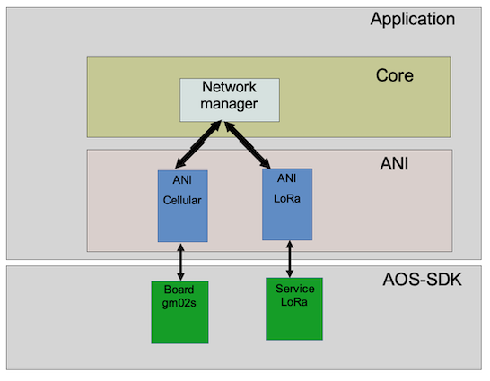
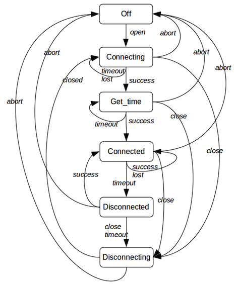
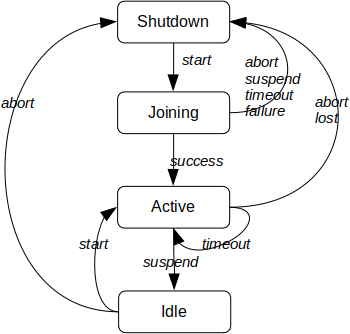
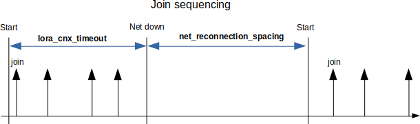
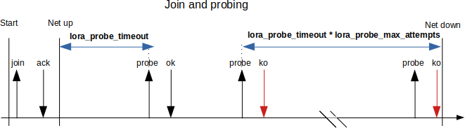
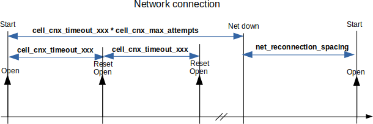
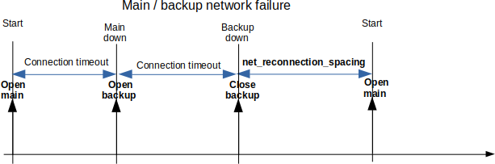
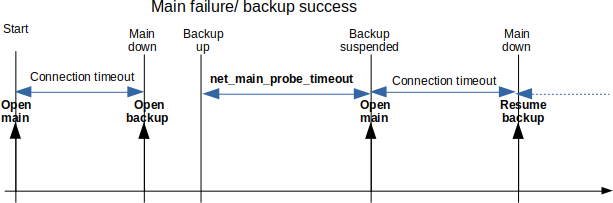

# Networking

## Overview

The networking part can handle both LoRa and cellular based networks. It
is designed as follows:

## Network manager

The network manager drives the LoRaWAN and the cellular network interfaces (ANI) and selects which one is active at a given time. The cellular and LoRaWAN networks cannot be active at the
same time due to antenna sharing.

The network connectivity management is built around a FSM.

***Operations***

The network manager selects the active WAN connectivity technology according to the
*net_type_selection* parameter:
-   lorawan_only: The network manager uses only LoRaWAN. It never
    switches to the cellular network.
-   cell_only: The network manager uses only the cellular network. It
    never switches to LoRaWAN.
-   lorawan_fallback_cell: The network manager uses LoRaWAN by default.
    In case of LoRaWAN network loss, it switches to the cellular
    network and periodically tries to reconnect to the LoRaWAN network. LoRaWAN is considered as the main network, while the
    cellular is considered as the backup network.
-   cell_fallback_lora: The network manager uses the cellular network by
    default. In case of cellular network loss, it switches to the LoRaWAN
    network and periodically tries to reconnect to the cellular network. Cellular is considered as the main network, while LoRaWAN
    is considered as the backup network.

When the network manager is in fallback mode (backup network active), it periodically probes the primary network: it suspends the backup network operations and attempts to reconnect
the main network.

***FSM states***

-   **Off**: Network manager is down.
-   **Main-connecting**: The connection to the main network is in
    progress
-   **Main-connected**: The main network is connected
-   **Backup-connecting**: The connection to the backup network is in
    progress
-   **Backup-connected:** The backup network is connected
-   **Main-checking**: The backup network is suspended. The network
    connection manager tries to reconnect the main network.
-   **Wait**: Wait for the end of the inter-connection duration

***FSM events***

-   *start*: Start the networking.
-   *failure*: Unrecoverable failure (SIM error for example in case of
    cell-only). In case of both networks used failure is generated only
    if both networks have unrecoverable failure.
-   *lost*: Network lost or fails to connect (recoverable failure)
-   *switch*: Switch between the main and backup network. This event is
    generated when the main network is lost and the network switching is
    allowed by configuration. If not allowed to switch, this event is
    not generated and a lost event is sent to the FSM.
-   *probe*: Start the main re-connection attempt.
-   *wait*: Inter-connection spacing requested. This event is sent only
    if the connection spacing timeout is configured and when:
    -   There is no backup network defined or in permanent error.
    -   We are in **backup-connecting** state (meaning that the main
        network failed), and the backup network also fails.
-   *timeout*: connection spacing timeout

***FSM diagram***

 

### Application message routing

The network manager offers data several pipes to the application. It
maps a given data pipe to a given cellular UDP/TCP socket or a LoRaWAN
"socket".

## Cellular ANI

The cellular ANI performs the following tasks:

-   Drives the cellular driver for the Sequans GM02s module which supports both
    LTE-M and NB-IOT.
-   Manages the cellular connectivity (configuration, network
    attachment/detachment,).
-   Manages the UDP/TCP sockets
-   Manages the messages received from the LTE network and forwards them
    to the network manager.
-   Manages the messages sent by application (via the network manager)
    and forwards them to the network.

***ANI design***

The interface with the Network manager is based on direct calls from the Network manager to the ANI and notifications from the ANI to the Network
manager via a callback function.

***ANI operation***

-   The Network manager opens the ANI for LTE connectivity
-   The request is forwarded to the socket management
-   The socket manager opens the cellular network management
-   The connection management forwards the connectivity result to the
    socket management
-   On connection success, the socket management opens its socket(s) and
    informs the Network manager of the success.
-   On connection failure, the socket management informs the Network
    manager of the failure.
-   Once connection is established and a network failure is reported by
    the connection management, the socket management closes its
    socket(s) and informs the Network manager.

The ANI logic drives the network management subsystem and the socket
management subsystem.

### Network management

The cellular network interface requires a SIM card that contains operator information, credentials, and service profiles.
Depending on the Abeeway hardware platform, up to two SIMs may be available:

- SIM0 – the physical micro-SIM card inserted into the PCBA SIM tray.

- SIM1 – available only on configurations where an eSIM is soldered onto the PCBA (special-order variants).

### Cellular connection management

***Overview***

The modem notifies the status of the connection as well as its establishment through unsolicited notifications, called "CEREG URC" :

-   0: No search
-   1: Registered against the home network
-   2: Searching
-   3: Registration denied
-   4: Out of network coverage
-   5: Connected via roaming
-   80: Network temporarily lost.

The cellular connection management also enables the SIM status unsolicited notifications :

-   0: No SIM card detected.
-   1: SIM under initialization
-   2: SIM locked (PIN or PUK required)
-   3: SIM invalid
-   4: SIM card failure
-   5: SIM card ready
-   6: PH-NET pin required
-   7: Phone-to-SIM password required
-   8: Invalid SIM card in PS (Packet Switched) domain
-   9: Invalid SIM card in PS (Packet Switched) and CS (Carrier
    Switched) domain
-   10: Invalid SIM card in CS (Carrier Switched) domain

The cellular connection management is based on the finite state machine (FSM) described below.

***Contextual variables***

-   state: Current state of the FSM
-   timer: Timer used by the FSM
-   reason: Disconnection reason.
-   connected_once: Boolean indicating whether cellular network has been
    connected at least once.

***FSM states***

-   Off: The modem is shutdown
-   Connecting: The modem is attaching to the network.
-   Get_time: Request the UTC time to the network.
-   Connected: The modem is attached to the network.
-   Disconnected: The network has been lost.
-   Disconnecting: The modem is being disconnected.
-   Suspending: The modem is being suspended.
-   Suspended: The mode is suspended.

***FSM events***

-   *open*: Administrative event sent by the network manager to open the cellular connection or when the suspended state should be left.
-   *close*: Event sent by the network manager or by the ANI itself if there are no more sockets open.
-   *timeout*: Timer elapsed.
-   *success*: Successfully connected and attached to the network (Got CEREG 1 or 5).
-   *get_time*: Get time request successfully answered.
-   *lost*: Network temporary lost (CEREG=80).
-   *closed*: Sent to the FSM once the disconnection is complete
-   *abort*: Abort requested by the manager to shutdown the network (non graceful close).

***State diagram***

***Notes***

-   In the state Connecting: Each *timeout* event resets and restarts the GM02S and increases the attempts counter. After n attempts, the
    *abort* event is generated.
-   In the state Get_time, if the network has been connected at least once, the state is skipped.
-   In the state Get_time, the request can be sent up to 3 times. The ***timeout*** event for this state is generated each 15 s. If the
    request definitely fails after 3 attempts, the FSM moves in the connected state (since there can be other sources to get the UTC
    time, e.g LoRa or GPS).
-   In the state Connected, if a lost event occurs, a timer is started to allow the modem to recover the network. When it elapses,
    the event timeout is generated.

### Cellular socket management

The socket management is built around the finite state machine (FSM) described below. The FSM is replicated for each configured socket.

The GM02s driver is able to process only one socket at a time, so the cellular socket management serializes the opening/closing
socket requests.

The cellular network management sends the *sock_open* event to the socket FSM whenever the cellular network manager enters the Connected state and
sends the *net_down* event whenever the network manager reaches the Off state.

***FSM states***

-   Closed: The socket is closed.
-   Starting: The socket should be open and is waiting for either the
    network up or the GM02S ready to send socket requests.
-   Opening: The socket is being opened.
-   Opened: The socket is open. Data traffic can flow
-   Stopping: The socket should be close and is waiting for the GM02S
    ready to send socket requests.
-   Closing: The socket is being closed.

***FSM events***

-   *sock_open*: Event issued to open the socket
-   *sock_close*: Either an administrative close request has been issued
    either by the above-layer/configuration or due to a failure.
-   *ready:* Event issued when the network is up or when the GM02S is
    ready to accept requests.
-   *net_down*: Event issued by GM02S driver indicating that the network
    is down.
-   *success*: Event triggered by the GM02S driver indicating that the
    socket opening is successful.
-   *failure*: Event triggered by the GM02S driver indicating that the
    socket opening failed or if the socket has been remotely closed or
    if a driver socket related error occurs.
-   *closed*: Event triggered by the GM02S driver indicating that the
    socket is closed.

***FSM diagram***

***Notes***

-   The *ready* event is sent by the Network FSM when it reaches the connected state.
-   The *net_down* event is generated by the Network FSM when the state Off is entered.
-   In state Opened, the data traffic can flow if and only if the network FSM is in state Connected.
-   Only one socket gets the *ready* event at a time.
-   The *net_down* event is sent to all sockets.

***Dynamic configuration***

To be properly configured the socket should have at least the destination IP/URL address and the destination port.

When configured and the network opened but not connected, the socket FSM goes in state starting and remains in this state until the network is
reachable.

When the network is connected and the socket is unconfigured (port = 0 or no IP address), the socket moves to the close state. In addition
if there is no more sockets opened, the network is shutdown.

***Transmission over a socket***

Each socket has its own transmission queue handling up to 5 messages.

In order to optimize power consumption, the actual transmission
follows the rules:
-   Send ASAP if the network is connected and the modem is active (not in deep sleep).
-   Postponed by the TX aggregation timer if the network is connected and the modem is sleeping and the transmission queue is not almost
    full (less than 4 buffers)
-   Send ASAP if the network is connected and the queue is almost full (greater than or equal to 4 buffers including the new one)
-   Send ASAP when the aggregation timer elapsed and the network is connected
-   Postponed until recovery if the network is disconnected.

*Note*

-   When the opportunity of transmission occurs, all buffers are sent.
-   When the transmission queue becomes full (can arise if network
    disconnected), the oldest message is removed from the queue.
-   Each socket has its own TX aggregation timer (and configuration)

## LoRaWAN ANI

The LoRaWAN ANI module controls the LoRaWAN part of the LR1110. It sits on the
top of the LoRaWAN service. As of today, only the LoRaWAN class A is
supported. Next releases will address also class B.

### ANI operation

-   Attach to the LoRaWAN network (Join sequences).
-   Leave the network (useful when LTE is also present on the board).
    Note that both LTE and LoRa cannot run at the same time (antenna
    sharing).
-   Support multiple lora-sockets. Each sockets are characterized by a
    specific UL port and a specific DL port. The term lora-socket (which
    is not an usual UDP/TCP socket) is generalized by analogy to TCP/IP
    over LTE.
-   As LTE, each lora-socket has it own queue to send traffic (uplinks).
-   Support multiple type of transmission strategies (ADR, random,
    custom, and so on)
-   Support single or dual transmissions.
-   Probing the network once joined
-   Send periodic heatbeat uplinks to trigger downlinks.

### Network probing

Probing process is driven by two parameters per motion state:
- `lorawan_probe_period_static` / `lorawan_probe_period_motion`: Interval (seconds) between link-check requests.
- `lorawan_probe_max_attempts_static` / `lorawan_probe_max_attempts_motion`: Number of **consecutive** failed link-check requests after which the LoRaWAN network is considered **lost**.

Probing can be configured to work in both motion states (static and motion) or only in one of them, or be completely disabled :

- To enable probing for **both** motion states, set `lorawan_probe_max_attempts_motion` and `lorawan_probe_max_attempts_static` to **non-zero** values.
- To enable probing only when the device is static, set `lorawan_probe_max_attempts_motion` to **0** and `lorawan_probe_max_attempts_static` to a **non-zero** value.
- To enable probing only when the device is in motion, set `lorawan_probe_max_attempts_static` to **0** and `lorawan_probe_max_attempts_motion` to a **non-zero** value.
- To disable probing, set a value of **0** for **both** `lorawan_probe_max_attempts_static` and `lorawan_probe_max_attempts_motion`. 

When the configured probe period elapses (`lorawan_probe_period_static` or `lorawan_probe_period_motion`, depending on the motion state), the device sends a **link-check** request (LoRaWAN `LinkCheckReq`).  
If the number of **consecutive** failed link checks reaches the configured limit (`lorawan_probe_max_attempts_static` / `lorawan_probe_max_attempts_motion`), the LoRaWAN network is considered **lost**.

:::note
Please note that probing period is compared to a total accumulated time since the last probe. Even if the probing period changes, following a state change, the timer will remain the same. In other words, imagine the following scenario:

- `lorawan_probe_period_static` is set to 3600s.
- `lorawan_probe_period_motion` is set to 300s.
- The device has been static for 1800s
- Then the device starts to move.
 
At that time, accumulated timer equals 1800s which is more than `lorawan_probe_period_motion`. Therefore, a probe is immediately sent. 
:::

If probing concludes that the network is lost, the ANI module attempts to **rejoin**.

:::warning
Some LoRaWAN network servers will not make the application server aware of LinkCheckReq commands sent by a device. This has no consequences for the device but may cause confusion when troubleshooting as it can be falsely interpreted as packet loss if you are logging uplinks from the application server.
:::

### Join process

AT3 uses the LBM randomization and datarate distribution (which consists
of an array of 16 entries). Each entry is a datarate. The LBM selects
randomly one entry at a time. Once used, the entry is tagged to avoid
reusing it. AT3 fills the array as follow:

-   Non US915 regions: The sequence \{DR0, DR1, DR2\} is repeated 5 times.
    The last entry is set to DR0.
-   US915: The sequence \{DR0, DR0, DR0, DR0, DR0, DR0, DR4\} is repeated
    twice. The last entry is set to DR0.

In practice, on EU868 region, the Join request uses SF 10/11/12 randomly
-	During the first hour , 35 Join requests are sent out, randomized with an interval of 50sec, 1mn30s and 2mn40s
-	During the next 10 hours, 38 Join Requests are sent out, randomized with an interval of 6mn22s, 13mn50s and 24mn50s
-	At the 11th hours, around 9 Join Requests per day are sent out, randomized with an interval of 1h; 2h17mn and 4h7mn

During this process, a connection timer is started if parameter ***lorawan_cnx_timeout*** is not null. Once the timer elapses, a timeout event
is sent to the FSM and a LoRa leave is done.

:::warning
 If ***net_reconnection_spacing*** is not set to 0, the new join attempt will be deferred by the net_reconnection_spacing period. Note that after each reconnection period spacing the back-off algorithm is reset, therefore the impact on battery can be significant if a network is not available (in case you want to ship devices in join mode, prefer configurations that operate on LoRaWAN only, and reconfigure via the network after joining).
:::

The ANI is built around the following FSM.

***FSM states***

-   Shutdown: Network not joined.
-   Joining: The join process is in progress.
-   Idle: Network joined but not accessible (e.g. LTE is active).
-   Active: Network accessible (joined and no LTE).

***FSM events***

-   *start*: Start the join process or resume the LoRa activity
-   *suspend*: Suspend LoRa
-   *timeout*: Timer expiry
-   *failure*: Unrecoverable failure (no LoRa socket)
-   *success*: Join success
-   *lost*: Network probing failure.
-   *abort*: Leave and stop the network.

***FSM diagram***

:::note
 The *timeout* event in the active state is triggered by the network
 probing timer, which triggers a link-check request.
:::

## Operational modes and configuration

This section covers the networking configuration as well as the
operational modes. Relevant configuration is handled by the dedicated
configuration groups. Note that in case of non LTE capable trackers, the
cellular configuration group is not accessible and the network group has
a reduced parameter set.

### Configuring LoRaWAN

LoRaWAN is configured via the LoRaWAN parameter group. The relevant parameters are:

- **`net_selection`**: Network selection. Use value **0** (**LoRaWAN only**).
- **`net_reconnection_spacing_static` / `net_reconnection_spacing_motion`**: Interval (seconds) between **network-down detection** and the next reconnection attempt (new **join**).
- **`lorawan_cnx_timeout`**: Maximum time budget to successfully **join** a LoRaWAN network. After this delay, the LoRaWAN network is considered **down**. A value of **0** lets the join mechanism run indefinitely (join attempts back off exponentially as mandated by the LoRaWAN specification).
- **`lorawan_heartbeat_period`**: Period (seconds) for the heartbeat timer. When it elapses, a heartbeat uplink is sent, opening the Class-A **RX1/RX2** windows for downlinks. A value of **0** disables the timer. The timer restarts whenever **any** uplink is sent.
:::note
The associated 'heartbeat' notification must also be enabled via parameter `core_notif_enable`.
:::
- **`lorawan_probe_max_attempts_static` / `lorawan_probe_max_attempts_motion`**: Number of **consecutive** failed link-check requests after which the LoRaWAN network is considered **down**. The periodic link-check mechanism starts only **after a successful join**.  
  `lorawan_probe_max_attempts_static` must be **≥** `lorawan_probe_max_attempts_motion`.
- **`lorawan_probe_period_static` / `lorawan_probe_period_motion`**: Interval between link-check requests.

The `_static` parameters are used when the tracker is **static**; the `_motion` parameters are used when the tracker is **in motion**.

:::note
The detection window before declaring the LoRaWAN network **down** is approximately:  
`lorawan_probe_max_attempts * lorawan_probe_period` (for the current motion state).  
After this duration elapses with consecutive failures, the manager leaves the network and attempts to **rejoin**.
:::

The following diagrams illustrate the various LoRaWAN timers. For simplicity, the `_static` and `_motion` suffixes are omitted.

### Configuring the cellular network

The cellular network is configured via the cellular parameter group. The relevant parameters are:

- **`net_selection`**: Use value **1** (**cellular only**).
- **`net_reconnection_spacing_static` / `net_reconnection_spacing_motion`**: Interval (seconds) between **network-down detection** and the next reconnection attempt.
- **`cell_cnx_timeout_static` / `cell_cnx_timeout_motion`**: Maximum time budget to successfully **connect** to the cellular network (per motion state).
- **`cell_cnx_max_attempts`**: Maximum number of **consecutive** failed connection attempts before the cellular network is reported **unavailable** to the network manager.

The `_static` parameters are used when the tracker is **static**; the `_motion` parameters are used when the tracker is **in motion**.

:::note
When `cell_cnx_max_attempts` is exceeded, the manager marks cellular as **down** and applies the policy defined by `net_selection` (e.g., retry after `net_reconnection_spacing_*` or switch per your fallback policy).
:::

The following timing diagram shows the connection processing. For simplicity, the `_static` and `_motion` suffixes are omitted.

 

### Configuring main and backup networks

In dual-network configurations, both networks are configured and `net_selection` defines which one is **main** and which one is **backup**.

**Behavior**
- The connection manager attempts to connect to the **main** network.
- If the main network fails, it attempts to connect to the **backup** network.
- If **both** networks fail, the manager waits for `net_reconnection_spacing_static` / `net_reconnection_spacing_motion` (based on motion state), then retries the **main** network.
- While operating on the **backup** network, the manager **probes** the main network. After each `net_main_probe_timeout_static` / `net_main_probe_timeout_motion`, it **suspends** the backup link and tries to reconnect to the main network.  
  - If reconnection **succeeds**, the main network remains active.  
  - Otherwise, the backup link is **resumed** and the probe timer restarts.

> During a main-network probe, backup connectivity is suspended (the application cannot send payloads).

**Parameters**
- **`net_selection`**  
  - **2**: LoRaWAN is the **main** network; cellular is **backup**.  
  - **3**: Cellular is the **main** network; LoRaWAN is **backup**.
- **`net_reconnection_spacing_static` / `net_reconnection_spacing_motion`**  
  Interval between detecting that **both** networks are down and the next attempt to reconnect the **main** network.
- **`net_main_probe_timeout_static` / `net_main_probe_timeout_motion`**  
  Interval between **main-network probe** attempts while the **backup** network is active.

LoRaWAN-specific and cellular-specific parameters should be set as described in the previous sections (e.g., `lorawan_cnx_timeout`, `cell_cnx_timeout_static` / `cell_cnx_timeout_motion`, etc.).

The following timing diagrams show the connection processing. For simplicity, the `_static` and `_motion` suffixes are omitted.

:::note
The `net_main_probe_timeout` duration is also based on the accelerometer state and follows the same management: for each motion state, an independent timer is used to accumulate the total elapsed time in each state.
:::